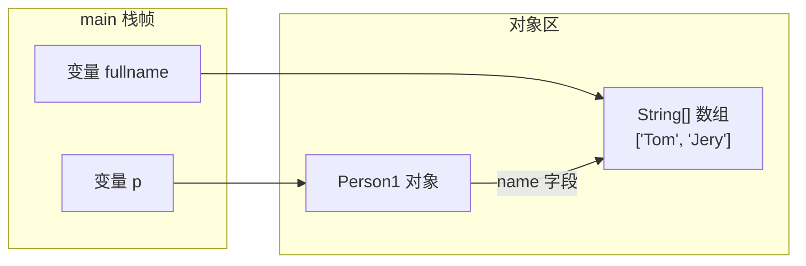
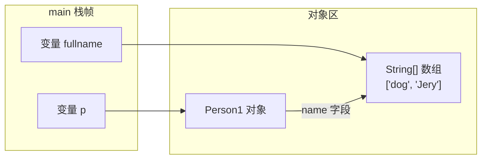
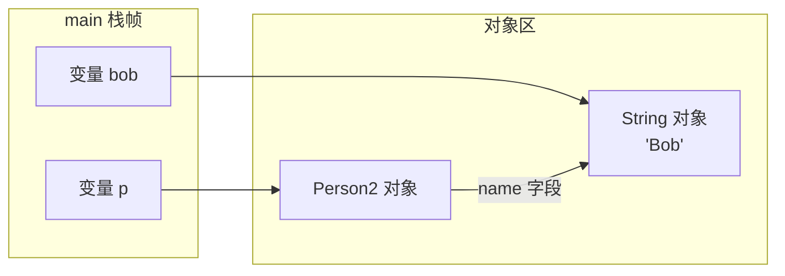
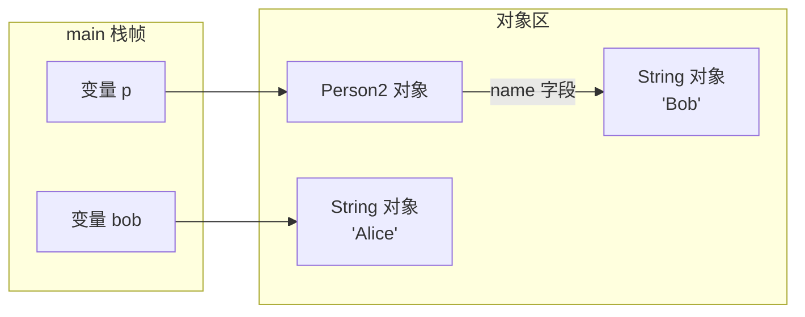

# playground-java-basics

## 模块目标
练 Java 基础语法、面向对象、集合、异常、泛型、反射、IO/NIO、Lambda 和 Stream。

## 学习范围
- `oop`
- `collection`
- `generic`
- `exception`
- `reflection`
- `io`
- `nio`
- `lambda`
- `stream`

## 包结构说明
- `oop`：面向对象练习包，放封装、继承、多态、接口和抽象类示例。
- `collection`：集合练习包，放 `List`、`Set`、`Map` 以及遍历、排序实验。
- `generic`：泛型练习包，放泛型类、泛型方法、通配符示例。
- `exception`：异常练习包，放异常分类、自定义异常和异常处理流程示例。
- `reflection`：反射练习包，放获取类信息、调用方法、操作字段等实验。
- `io`：传统 IO 练习包，放字节流、字符流、文件读写内容。
- `nio`：NIO 练习包，放 `Buffer`、`Channel`、`Path` 等实验。
- `lambda`：Lambda 表达式练习包，放函数式接口和简化写法示例。
- `stream`：Stream 流式处理练习包，放过滤、映射、聚合、分组操作。

## 学习资源
- [内部资源清单](../docs/resources/java-basics.md)
- [廖雪峰 Java 教程](https://liaoxuefeng.com/books/java/introduction/)
- [JavaGuide Java 学习路线](https://javaguide.cn/interview-preparation/java-roadmap.html)

## 练习任务
- [ ] 每个包写一个最小可运行示例
- [ ] 集合、反射、Stream 各补一份笔记
- [ ] 用测试或 `main` 方法复现实验结果

## 笔记区
### 第一章节、面向对象编程

#### 1.1 面向对象基础

##### 1.1.1 方法

- 方法可以让外部代码安全地访问实例字段；
- 方法是一组执行语句，并且可以执行任意逻辑；
- 方法内部遇到return时返回，void表示不返回任何值（注意和返回null不同）；
- 外部代码通过public方法操作实例，内部代码可以调用private方法；
- 方法的参数绑定理解：

参考canshubangding_02和canshubangding_03中的main方法输出的结果

**canshubangding_02**



这时 fullname 和 p.name 指向的是同一个数组对象。

执行 fullname[0] = "dog"; 后：



这里不是改“指向”，而是改“同一个数组对象内部的元素”，所以 p.getName() 也变了。

**canshubangding_03**
对应代码：canshubangding_03.java (line 7)

p.setName(bob); 执行后：



执行 bob = "Alice"; 后：



这里改的是 bob 这个变量的绑定方向，让它去指向新的 "Alice"；p.name 仍然指向原来的 "Bob"，所以输出没变。

**一句话记忆**
Java 的引用参数传递本质上仍然是“值传递”：

- 传过去的是“引用值的副本”
- 如果通过这个引用去改同一个对象，外面能看到
- 如果只是让某个变量重新指向别的对象，外面看不到


##### 1.1.2 构造方法

实例在创建时通过`new`操作符会调用其对应的构造方法，构造方法用于初始化实例；

没有定义构造方法时，编译器会自动创建一个默认的无参数构造方法；

可以定义多个构造方法，编译器根据参数自动判断；

可以在一个构造方法内部调用另一个构造方法，便于代码复用。主要通过this.()进行调用

```java
class Person {
    private String name;
    private int age;

    public Person(String name, int age) {
        this.name = name;
        this.age = age;
    }

    public Person(String name) {
        this(name, 18); // 调用另一个构造方法Person(String, int)
    }

    public Person() {
        this("Unnamed"); // 调用另一个构造方法Person(String)
    }
}

```


##### 1.1.3 重载方法

这种方法名相同，但各自的参数不同，称为方法重载（`Overload`）

方法重载的目的是，功能类似的方法使用同一名字，更容易记住，因此，调用起来更简单。(构造函数就似乎典型的例子)


##### 1.1.4 继承

继承是面向对象编程的一种强大的代码复用方式；

Java只允许单继承，所有类最终的根类是`Object`；

`protected`允许子类访问父类的字段和方法；

子类的构造方法可以通过`super()`调用父类的构造方法；

可以安全地向上转型为更抽象的类型；

可以强制向下转型，最好借助`instanceof`判断；

子类和父类的关系是is，has(组合)关系不能用继承。


##### 1.1.5 多态

子类可以覆写父类的方法（Override），覆写在子类中改变了父类方法的行为；

Java的方法调用总是作用于运行期对象的实际类型，这种行为称为多态；

`final`修饰符有多种作用：

- `final`修饰的方法可以阻止被覆写；
- `final`修饰的class可以阻止被继承；
- `final`修饰的field必须在创建对象时初始化，随后不可修改。


##### 1.1.6 抽象类

无法实例化的抽象类有什么用？

因为抽象类本身被设计成只能用于被继承，因此，抽象类可以强迫子类实现其定义的抽象方法，否则编译会报错。因此，抽象方法实际上相当于定义了**“规范”**。这就是面向抽象编程。

面向抽象编程的本质就是：

- 上层代码只定义规范（例如：`abstract class Person`）；
- 不需要子类就可以实现业务逻辑（正常编译）；
- 具体的业务逻辑由不同的子类实现，**调用者并不关心**。


##### 1.1.7 接口

Java的接口（interface）定义了纯抽象规范，一个类可以实现多个接口；

接口也是数据类型，适用于向上转型和向下转型；

接口的所有方法都是抽象方法，接口不能定义实例字段；

接口可以定义`default`方法（JDK>=1.8)


在抽象类中，抽象方法本质上是定义接口规范：即规定高层类的接口，从而保证所有子类都有相同的接口实现，这样，多态就能发挥出威力。

如果一个抽象类没有字段，所有方法全部都是抽象方法：就可以把该抽象类改写为接口：`interface`

所谓`interface`，就是比抽象类还要抽象的纯抽象接口，因为它连字段都不能有。因为接口定义的所有方法默认都是`public abstract`的。

实现类可以不必覆写`default`方法。`default`方法的目的是，当我们需要给接口新增一个方法时，会涉及到修改全部子类。如果新增的是`default`方法，那么子类就不必全部修改，只需要在需要覆写的地方去覆写新增方法。


##### 1.1.8 静态字段和静态方法

静态字段属于所有实例“共享”的字段，实际上是属于`class`的字段；

调用静态方法不需要实例，无法访问`this`，但可以访问静态字段和其他静态方法；

静态方法常用于工具类和辅助方法。

**接口的静态字段**

因为`interface`是一个纯抽象类，所以它不能定义实例字段。但是，`interface`是可以有静态字段的，并且静态字段必须为`final`类型：

```java
public interface Person {
    public static final int MALE = 1;
    public static final int FEMALE = 2;
}
```

实际上，因为`interface`的字段只能是`public static final`类型，所以我们可以把这些修饰符都去掉，上述代码可以简写为：

```java
public interface Person {
    // 编译器会自动加上public static final:
    int MALE = 1;
    int FEMALE = 2;
}
```


##### 1.1.9 包

Java内建的`package`机制是为了避免`class`命名冲突；

JDK的核心类使用`java.lang`包，编译器会自动导入；

JDK的其它常用类定义在`java.util.*`，`java.math.*`，`java.text.*`，……；

包名推荐使用倒置的域名，例如`org.apache`。


##### 1.1.10 作用域

Java内建的访问权限包括`public`、`protected`、`private`和`package`权限；

Java在方法内部定义的变量是局部变量，局部变量的作用域从变量声明开始，到一个块结束；

`final`修饰符不是访问权限，它可以修饰`class`、`field`和`method`；

一个`.java`文件只能包含一个`public`类，但可以包含多个非`public`类。


**最佳实践**

如果不确定是否需要`public`，就不声明为`public`，即尽可能少地暴露对外的字段和方法。

把方法定义为`package`权限有助于测试，因为测试类和被测试类只要位于同一个`package`，测试代码就可以访问被测试类的`package`权限方法。

一个`.java`文件只能包含一个`public`类，但可以包含多个非`public`类。如果有`public`类，文件名必须和`public`类的名字相同。

**final**

用`final`修饰`class`可以阻止被继承；

用`final`修饰`method`可以阻止被子类覆写；

用`final`修饰`field`可以阻止被重新赋值；


##### 1.1.11 内部类

还有一种类，它被定义在另一个类的内部，所以称为内部类（Nested Class）

示例代码：

```java
// inner class
public class Main {
    public static void main(String[] args) {
        Outer outer = new Outer("Nested"); // 实例化一个Outer
        Outer.Inner inner = outer.new Inner(); // 实例化一个Inner
        inner.hello();
    }
}

class Outer {
    private String name;

    Outer(String name) {
        this.name = name;
    }

    class Inner {
        void hello() {
            System.out.println("Hello, " + Outer.this.name);
        }
    }
}

```

还有一种定义Inner Class的方法，它不需要在Outer Class中明确地定义这个Class，而是在方法内部，通过**匿名类**（Anonymous Class）来定义。

```java
// Anonymous Class
public class Main {
    public static void main(String[] args) {
        Outer outer = new Outer("Nested");
        outer.asyncHello();
    }
}

class Outer {
    private String name;

    Outer(String name) {
        this.name = name;
    }

    void asyncHello() {
        Runnable r = new Runnable() {
            @Override
            public void run() {
                System.out.println("Hello, " + Outer.this.name);
            }
        };
        new Thread(r).start();
    }
}

```

观察`asyncHello()`方法，我们在方法内部实例化了一个`Runnable`。`Runnable`本身是接口，接口是不能实例化的，所以这里实际上是定义了一个实现了`Runnable`接口的匿名类，并且通过`new`实例化该匿名类，然后转型为`Runnable`。在定义匿名类的时候就必须实例化它，定义匿名类的写法如下：

```java
Runnable r = new Runnable() {
    // 实现必要的抽象方法...
};
```


##### 1.1.12 字符串和编码

Java字符串`String`是**不可变对象**；

字符串操作不改变原字符串内容，而是返回新字符串；

常用的字符串操作：提取子串、查找、替换、大小写转换等；

Java使用Unicode编码表示`String`和`char`；

转换编码就是将`String`和`byte[]`转换，需要指定编码；

转换为`byte[]`时，始终优先考虑`UTF-8`编码。


#### 2.1 java核心类

##### 2.1.1 StringBUilder

`StringBuilder`是可变对象，用来高效拼接字符串；

`StringBuilder`可以支持链式操作，实现链式操作的关键是返回实例本身；

`StringBuffer`是`StringBuilder`的线程安全版本，现在很少使用。


##### 2.1.2 包装类型

Java的数据类型分两种：

- 基本类型：`byte`，`short`，`int`，`long`，`boolean`，`float`，`double`，`char`；
- 引用类型：所有`class`和`interface`类型。

引用类型可以赋值为`null`，表示空，但基本类型不能赋值为`null`：


Java核心库提供的包装类型可以把基本类型包装为`class`；

自动装箱和自动拆箱都是在编译期完成的（JDK>=1.5）；

装箱和拆箱会影响执行效率，且拆箱时可能发生`NullPointerException`；

包装类型的比较必须使用`equals()`；

整数和浮点数的包装类型都继承自`Number`；

包装类型提供了大量实用方法；

所有的包装类型都是不变类。

**最佳实践**

因为`Integer.valueOf()`可能始终返回同一个`Integer`实例，因此，在我们自己创建`Integer`的时候，以下两种方法：

- 方法1：`Integer n = new Integer(100);`
- 方法2：`Integer n = Integer.valueOf(100);`

方法2更好，因为方法1总是创建新的`Integer`实例


##### 2.1.3 枚举

Java使用`enum`定义枚举类型，它被编译器编译为`final class Xxx extends Enum { … }`；

通过`name()`获取常量定义的字符串，注意不要使用`toString()`；

通过`ordinal()`返回常量定义的顺序（无实质意义）；

可以为`enum`编写构造方法、字段和方法

`enum`的构造方法要声明为`private`，字段强烈建议声明为`final`；

`enum`适合用在`switch`语句中。


```java
public class meiju_10 {
    public static void main(String[] args) {
        /*Weekday day = Weekday.SUN;
        if (day == Weekday.SAT || day == Weekday.SUN) {
            System.out.println("Work at home!");
        } else {
            System.out.println("Work at office!");
        }*/

        /*int day = 1;
        if (day == Weekday.SUN) { // Operator '==' cannot be applied to 'int', 'com.learning.basics.oop
        }*/

        /*Weekday x = Weekday.SUN; // ok!
        Weekday y = Color.RED; // Compile error: incompatible types*/

        /*
        使用enum定义的枚举类是一种引用类型。
        引用类型比较，要使用equals()方法，如果使用==比较，它比较的是两个引用类型的变量是否是同一个对象。
        但enum类型可以例外。
        这是因为enum类型的每个常量在JVM中只有一个唯一实例，所以可以直接用==比较。
         */
        /*Weekday day = Weekday.MON;
        if (day == Weekday.FRI) { // ok!
        }
        if (day.equals(Weekday.SUN)) { // ok, but more code!
        }*/

        System.out.println(Weekday.MON.name()); // MON
        System.out.println(Weekday.THU.ordinal()); // 4
    }
}

enum Weekday {
    SUN, MON, TUE, WED, THU, FRI, SAT;
}

enum Color {
    RED, GREEN, BLUE;
}
```


##### 2.1.4 BigInteger

`BigInteger`用于表示任意大小的整数；

`BigInteger`是不变类，并且继承自`Number`；

将`BigInteger`转换成基本类型时可使用`longValueExact()`等方法保证结果准确。

```java
public class biginteger_11 {
    public static void main(String[] args) {

        // 定义
        BigInteger bi = new BigInteger("12345567890");

        // 乘法
        System.out.println(bi.pow(5));

        // 加法
        System.out.println(bi.add(new BigInteger("12345678901234567890")));

        BigInteger i = new BigInteger("123456789000");
        System.out.println(i.longValue()); // 123456789000
        System.out.println(i.multiply(i).longValueExact()); // Exception in thread "main" java.lang.ArithmeticException: BigInteger out of long range
    }
}
```


##### 2.1.5 BigDecimal

`BigDecimal`用于表示精确的小数，常用于财务计算；

比较`BigDecimal`的值是否相等，必须使用`compareTo()`而不能使用`equals()`。

```java
public class bigdecimal_12 {

    public static void main(String[] args) {
        // BigDecimal用scale()表示小数位数
        BigDecimal d1 = new BigDecimal("123.45");
        BigDecimal d2 = new BigDecimal("123.4500");
        BigDecimal d3 = new BigDecimal("1234500");
        System.out.println(d1.scale()); // 2,两位小数
        System.out.println(d2.scale()); // 4
        System.out.println(d3.scale()); // 0
        System.out.println("==============================");

        // 通过BigDecimal的stripTrailingZeros()方法，可以将一个BigDecimal格式化为一个相等的，但去掉了末尾0的BigDecimal：
        BigDecimal d4 = new BigDecimal("123.4500");
        BigDecimal d5 = d4.stripTrailingZeros();
        System.out.println(d4.scale()); // 4
        System.out.println(d5.scale()); // 2,因为去掉了00

        BigDecimal d6 = new BigDecimal("1234500");
        BigDecimal d7 = d6.stripTrailingZeros();
        System.out.println(d6.scale()); // 0
        System.out.println(d7.scale()); // -2
        System.out.println("==============================");

        BigDecimal d8 = new BigDecimal("123.456789");
        BigDecimal d9 = d8.setScale(4, RoundingMode.HALF_UP); // 四舍五入，123.4568
        BigDecimal d10 = d8.setScale(4, RoundingMode.DOWN); // 直接截断，123.4567
        System.out.println(d9); // 123.4568
        System.out.println(d10); // 123.4567
        System.out.println("==============================");

        // 对BigDecimal做加、减、乘时，精度不会丢失，但是做除法时，存在无法除尽的情况，这时，就必须指定精度以及如何进行截断：
        BigDecimal d11 = new BigDecimal("123.456");
        BigDecimal d12 = new BigDecimal("23.456789");
        BigDecimal d13 = d11.divide(d12, 10, RoundingMode.HALF_UP); // 保留10位小数并四舍五入
        System.out.println(d13);
        BigDecimal d14 = d11.divide(d12); // 报错：ArithmeticException，因为除不尽

        // 在比较两个BigDecimal的值是否相等时，要特别注意，使用equals()方法不但要求两个BigDecimal的值相等，还要求它们的scale()相等：
        // 总是使用compareTo()比较两个BigDecimal的值，不要使用equals()！
    }
}

```


##### 2.1.6 常用工具类

- Math：数学计算
- HexFormat：格式化十六进制数
- Random：生成伪随机数
- SecureRandom：生成安全的随机数


### 第二章节、集合

#### 2.1 List

我们考察`List<E>`接口，可以看到几个主要的接口方法：

- 在末尾添加一个元素：`boolean add(E e)`
- 在指定索引添加一个元素：`boolean add(int index, E e)`
- 删除指定索引的元素：`E remove(int index)`
- 删除某个元素：`boolean remove(Object e)`
- 获取指定索引的元素：`E get(int index)`
- 获取链表大小（包含元素的个数）：`int size()`


实现`List`接口并非只能通过数组（即`ArrayList`的实现方式）来实现，另一种`LinkedList`通过“链表”也实现了List接口。在`LinkedList`中，它的内部每个元素都指向下一个元素：


我们来比较一下`ArrayList`和`LinkedList`：

|                     | ArrayList    | LinkedList           |
| ------------------- | ------------ | -------------------- |
| 获取指定元素        | 速度很快     | 需要从头开始查找元素 |
| 添加元素到末尾      | 速度很快     | 速度很快             |
| 在指定位置添加/删除 | 需要移动元素 | 不需要移动元素       |
| 内存占用            | 少           | 较大                 |

通常情况下，我们总是优先使用`ArrayList`。


```java
 public static void main(String[] args) {

        /*
        使用iterator进行遍历
         */
        List<String> list = List.of("1", "2", "3", "4", "5", "6", "7", "8", "9"); // 创建list可以使用List.of方法，但这种方法不接受null值
        Iterator<String> iterator = list.iterator();
        while (iterator.hasNext()) {
            System.out.println(iterator.next());
        }

        /*
        List和Array转换
         */
        List<Integer> list1 = List.of(12, 34, 56);
//        Object[] array = list1.toArray(); // 不推荐，此类转换会丢失类型信息
        Integer[] array = list1.toArray(new Integer[3]); // 推荐转换写法
    }
```


#### 2.2 Map

`Map`是一种映射表，可以通过`key`快速查找`value`；

可以通过`for each`遍历`keySet()`，也可以通过`for each`遍历`entrySet()`，直接获取`key-value`；

最常用的一种`Map`实现是`HashMap`


#### 2.3  equals和hashcode

equals正确覆写，使用Objects的静态方法

```java
    @Override
    public boolean equals(Object obj) {
        if(obj instanceof Person p) {
            return Objects.equals(this.firstName, p.firstName) && Objects.equals(this.lastName, p.lastName) && this.age == p.age;
        }
        return false;
    }
```


hashcode的覆写方式

```java
public class Person {
    String firstName;
    String lastName;
    int age;

    @Override
    int hashCode() {
        int h = 0;
        h = 31 * h + firstName.hashCode();
        h = 31 * h + lastName.hashCode();
        h = 31 * h + age;
        return h;
    }
}
```


要正确使用`HashMap`，作为`key`的类必须正确覆写`equals()`和`hashCode()`方法；

一个类如果覆写了`equals()`，就必须覆写`hashCode()`，并且覆写规则是：

- 如果`equals()`返回`true`，则`hashCode()`返回值必须相等；
- 如果`equals()`返回`false`，则`hashCode()`返回值尽量不要相等。

实现`hashCode()`方法可以通过`Objects.hashCode()`辅助方法实现。


#### 2.4 TreeMap

`SortedMap`在遍历时严格按照Key的顺序遍历，最常用的实现类是`TreeMap`；

作为`SortedMap`的Key必须实现`Comparable`接口，或者传入`Comparator`；

要严格按照`compare()`规范实现比较逻辑，否则，`TreeMap`将不能正常工作。


```java
public class a03_treemap {
    public static void main(String[] args) {
        Map<Person, Integer> map = new TreeMap<>(new Comparator<Person>() {
            @Override
            public int compare(Person o1, Person o2) {
                return o1.name.compareTo(o2.name);
            }
        });

        map.put(new Person("Tom"), 1);
        map.put(new Person("Jerry"), 2);
        map.put(new Person("Lily"), 3);
        for (Person key : map.keySet()) {
            System.out.println(key);
        }

        System.out.println(map.get(new Person("Lily")));
    }
}

class Person {
    public String name;

    public Person (String name) {
        this.name = name;
    }

    @Override
    public String toString() {
        return "{Person: " + name + "}";
    }
}
```

注意到`Comparator`接口要求实现一个比较方法，它负责比较传入的两个元素`a`和`b`，如果`a<b`，则返回负数，通常是`-1`，如果`a==b`，则返回`0`，如果`a>b`，则返回正数，通常是`1`。`TreeMap`内部根据比较结果对Key进行排序。

从上述代码执行结果可知，打印的Key确实是按照`Comparator`定义的顺序排序的。如果要根据Key查找Value，我们可以传入一个`new Person("Bob")`作为Key，它会返回对应的`Integer`值`2`。

另外，注意到`Person`类并未覆写`equals()`和`hashCode()`，因为`TreeMap`不使用`equals()`和`hashCode()`。


我们来看一个稍微复杂的例子：这次我们定义了`Student`类，并用分数`score`进行排序，高分在前：

```java
public class Main {
    public static void main(String[] args) {
        Map<Student1, Integer> map = new TreeMap<>(new Comparator<Student1>() {
            public int compare(Student1 p1, Student1 p2) {
                if (p1.score == p2.score) {
        			return 0;
    			}
                return p1.score > p2.score ? -1 : 1;
            }
        });
        map.put(new Student1("Tom", 77), 1);
        map.put(new Student1("Bob", 66), 2);
        map.put(new Student1("Lily", 99), 3);
        for (Student1 key : map.keySet()) {
            System.out.println(key);
        }
        System.out.println(map.get(new Student1("Bob", 66))); // null?
    }
}

class Student1 {
    public String name;
    public int score;
    Student1(String name, int score) {
        this.name = name;
        this.score = score;
    }
    public String toString() {
        return String.format("{%s: score=%d}", name, score);
    }
}
```

返回值有三种情况:0,正,负       

返回值为正: 前者(也就是o1)权重大,o1向后排      

 返回值为负: 后者(也就是o2)权重大,o2向后排       

返回值为0: 权重相等,不交换


#### 2.5 Set

`Set`用于存储不重复的元素集合，它主要提供以下几个方法：

- 将元素添加进`Set<E>`：`boolean add(E e)`
- 将元素从`Set<E>`删除：`boolean remove(Object e)`
- 判断是否包含元素：`boolean contains(Object e)`


```java
public class Main {
    public static void main(String[] args) {
        List<Message> received = List.of(
            new Message(1, "Hello!"),
            new Message(2, "发工资了吗？"),
            new Message(2, "发工资了吗？"),
            new Message(3, "去哪吃饭？"),
            new Message(3, "去哪吃饭？"),
            new Message(4, "Bye")
        );
        List<Message> displayMessages = process(received);
        for (Message message : displayMessages) {
            System.out.println(message.text);
        }
    }

    static List<Message> process(List<Message> received) {
        // TODO: 按sequence去除重复消息
        Set<Message> processed = new HashSet<>(received);
        List<Message> displayMessages = new ArrayList<>();
        for (Message message : processed) {
                displayMessages.add(message);
        }
        return displayMessages;
    }
}

class Message {
    public final int sequence;
    public final String text;
    public Message(int sequence, String text) {
        this.sequence = sequence;
        this.text = text;
    }

    @Override
    public int hashCode() {
        return this.sequence;
    }

    @Override
    public boolean equals(Object obj) {
        if (obj instanceof Message that) {
            return this.sequence == that.sequence;
        }
        return false;
    }
}
```


#### 2.6 Queue

队列`Queue`实现了一个先进先出（FIFO）的数据结构：

- 通过`add()`/`offer()`方法将元素添加到队尾；
- 通过`remove()`/`poll()`从队首获取元素并删除；
- 通过`element()`/`peek()`从队首获取元素但不删除。

要避免把`null`添加到队列。

```java
// 这是一个List:
List<String> list = new LinkedList<>();
// 这是一个Queue:
Queue<String> queue = new LinkedList<>();

```


#### 2.7 PriorityQueue

`PriorityQueue`实现了一个优先队列：从队首获取元素时，总是获取优先级最高的元素；

`PriorityQueue`默认按元素比较的顺序排序（必须实现`Comparable`接口），也可以通过`Comparator`自定义排序算法（元素就不必实现`Comparable`接口）

```java
public class Main {
    public static void main(String[] args) {
        Queue<User> q = new PriorityQueue<>(new UserComparator());
        // 添加3个元素到队列:
        q.offer(new User("Bob", "A1"));
        q.offer(new User("Alice", "A2"));
        q.offer(new User("Boss", "V1"));
        System.out.println(q.poll()); // Boss/V1
        System.out.println(q.poll()); // Bob/A1
        System.out.println(q.poll()); // Alice/A2
        System.out.println(q.poll()); // null,因为队列为空
    }
}

class UserComparator implements Comparator<User> {
    public int compare(User u1, User u2) {
        if (u1.number.charAt(0) == u2.number.charAt(0)) {
            // 如果两人的号都是A开头或者都是V开头,比较号的大小:
            return u1.number.compareTo(u2.number);
        }
        if (u1.number.charAt(0) == 'V') {
            // u1的号码是V开头,优先级高:
            return -1;
        } else {
            return 1;
        }
    }
}

class User {
    public final String name;
    public final String number;

    public User(String name, String number) {
        this.name = name;
        this.number = number;
    }

    public String toString() {
        return name + "/" + number;
    }
}
```


#### 2.8 Deque

`Deque`实现了一个双端队列（Double Ended Queue），它可以：

- 将元素添加到队尾或队首：`addLast()`/`offerLast()`/`addFirst()`/`offerFirst()`；
- 从队首／队尾获取元素并删除：`removeFirst()`/`pollFirst()`/`removeLast()`/`pollLast()`；
- 从队首／队尾获取元素但不删除：`getFirst()`/`peekFirst()`/`getLast()`/`peekLast()`；
- 总是调用`xxxFirst()`/`xxxLast()`以便与`Queue`的方法区分开；
- 避免把`null`添加到队列。

```java
// 不推荐的写法:
LinkedList<String> d1 = new LinkedList<>();
d1.offerLast("z");
// 推荐的写法：
Deque<String> d2 = new LinkedList<>();
d2.offerLast("z");
```


#### 2.9 Stack

栈（Stack）是一种后进先出（LIFO）的数据结构，操作栈的元素的方法有：

- 把元素压栈：`push(E)`；
- 把栈顶的元素“弹出”：`pop(E)`；
- 取栈顶元素但不弹出：`peek(E)`。

在Java中，我们用`Deque`可以实现`Stack`的功能，注意只调用`push()`/`pop()`/`peek()`方法，避免调用`Deque`的其他方法；

不要使用遗留类`Stack`。


#### 2.10 Iterator

Java的集合类都可以使用`for each`循环

```java
for (Iterator<String> it = list.iterator(); it.hasNext(); ) {
     String s = it.next();
     System.out.println(s);
}
```

while循环写法

```java
Iterator<String> it = list.iterator();
while(it.hasNext()){
    String s = it.next;
    System.out.println(s);
}
```


### 第三章节 泛型

使用泛型时，把泛型参数`<T>`替换为需要的class类型，例如：`ArrayList<String>`，`ArrayList<Number>`等；

可以省略编译器能自动推断出的类型，例如：`List<String> list = new ArrayList<>();`；

不指定泛型参数类型时，编译器会给出警告，且只能将`<T>`视为`Object`类型；


### 第四章节 异常

#### 4.1 捕获异常

捕获异常时，多个`catch`语句的匹配顺序非常重要，子类必须放在前面；

`finally`语句保证了有无异常都会执行，它是可选的；

一个`catch`语句也可以匹配多个非继承关系的异常。


因为处理`IOException`和`NumberFormatException`的代码是相同的，所以我们可以把它两用`|`合并到一起：

```java
public static void main(String[] args) {
    try {
        process1();
        process2();
        process3();
    } catch (IOException | NumberFormatException e) {
        // IOException或NumberFormatException
        System.out.println("Bad input");
    } catch (Exception e) {
        System.out.println("Unknown error");
    }
}
```


#### 4.2 抛出异常

调用`printStackTrace()`可以打印异常的传播栈，对于调试非常有用；

捕获异常并再次抛出新的异常时，应该持有原始异常信息；

通常不要在`finally`中抛出异常。如果在`finally`中抛出异常，应该原始异常加入到原有异常中。调用方可通过`Throwable.getSuppressed()`获取所有添加的`Suppressed Exception`。


```java
public class a02_yichang2 {
    public static void main(String[] args) {
        try {
            process1();
        } catch (Exception e) {
            e.printStackTrace();
        }
    }

    static void process1() {
        process2();
    }

    static void process2() {
        Integer.parseInt(null); // 会抛出NumberFormatException
    }
}
```

`printStackTrace()`对于调试错误非常有用，上述信息表示：`NumberFormatException`是在`java.lang.Integer.parseInt`方法中被抛出的，从下往上看，调用层次依次是：

1. `main()`调用`process1()`；
2. `process1()`调用`process2()`；
3. `process2()`调用`Integer.parseInt(String)`；
4. `Integer.parseInt(String)`调用`Integer.parseInt(String, int)`。


如何抛出异常？参考`Integer.parseInt()`方法，抛出异常分两步：

1. 创建某个`Exception`的实例；
2. 用`throw`语句抛出。

实际上，绝大部分抛出异常的代码都会合并写成一行：

```java
void process2(String s) {
    if (s==null) {
        throw new NullPointerException();
    }
}
```


如果一个方法捕获了某个异常后，又在`catch`子句中抛出新的异常，就相当于把抛出的异常类型“转换”了：

```java
public class Main {
    public static void main(String[] args) {
        try {
            process1();
        } catch (Exception e) {
            e.printStackTrace();
        }
    }

    static void process1() {
        try {
            process2();
        } catch (NullPointerException e) {
            throw new IllegalArgumentException();
        }
    }

    static void process2() {
        throw new NullPointerException();
    }
}
```

当`process2()`抛出`NullPointerException`后，被`process1()`捕获，然后抛出`IllegalArgumentException()`。

打印出的异常栈类似：

```java
java.lang.IllegalArgumentException
    at Main.process1(Main.java:15)
    at Main.main(Main.java:5)
```

这说明新的异常丢失了原始异常信息，我们已经看不到原始异常`NullPointerException`的信息了。

为了能追踪到完整的异常栈，在构造异常的时候，把原始的`Exception`实例传进去，新的`Exception`就可以持有原始`Exception`信息。对上述代码改进如下：

```java
// exception
public class Main {
    public static void main(String[] args) {
        try {
            process1();
        } catch (Exception e) {
            e.printStackTrace();
        }
    }

    static void process1() {
        try {
            process2();
        } catch (NullPointerException e) {
            throw new IllegalArgumentException(e);
        }
    }

    static void process2() {
        throw new NullPointerException();
    }
}
```


#### 4.3 自定义异常

抛出异常时，尽量复用JDK已定义的异常类型；

自定义异常体系时，推荐从`RuntimeException`派生“根异常”，再派生出业务异常；

自定义异常时，应该提供多种构造方法。


自定义的`BaseException`应该提供多个构造方法：

```java
public class BaseException extends RuntimeException {
    public BaseException() {
        super();
    }

    public BaseException(String message, Throwable cause) {
        super(message, cause);
    }

    public BaseException(String message) {
        super(message);
    }

    public BaseException(Throwable cause) {
        super(cause);
    }
}
```


其他业务类型的异常就可以从`BaseException`派生：

```java
public class UserNotFoundException extends BaseException {
}

public class LoginFailedException extends BaseException {
}
```


#### 4.4 NullPointerException

`NullPointerException`是一种代码逻辑错误，遇到`NullPointerException`，遵循原则是早暴露，早修复，严禁使用`catch`来隐藏这种编码错误：


好的编码习惯可以极大地降低`NullPointerException`的产生，例如：

成员变量在定义时初始化：

```java
public class Person {
    private String name = "";
}
```


如果调用方一定要根据`null`判断，比如返回`null`表示文件不存在，那么考虑返回`Optional<T>`：

```java
public Optional<String> readFromFile(String file) {
    if (!fileExist(file)) {
        return Optional.empty();
    }
    ...
}
```

这样调用方必须通过`Optional.isPresent()`判断是否有结果。


### 第五章节 反射

#### 5.1 class

JVM为每个加载的`class`及`interface`创建了对应的`Class`实例来保存`class`及`interface`的所有信息；

获取一个`class`对应的`Class`实例后，就可以获取该`class`的所有信息；

通过Class实例获取`class`信息的方法称为反射（Reflection）；

JVM总是动态加载`class`，可以在运行期根据条件来控制加载class。


JVM为每个加载的`class`创建了对应的`Class`实例，并在实例中保存了该`class`的所有信息，包括类名、包名、父类、实现的接口、所有方法、字段等，因此，如果获取了某个`Class`实例，我们就可以通过这个`Class`实例获取到该实例对应的`class`的所有信息。

方法一：直接通过一个`class`的静态变量`class`获取：

```java
Class cls = String.class;
```

方法二：如果我们有一个实例变量，可以通过该实例变量提供的`getClass()`方法获取：

```java
String s = "Hello";
Class cls = s.getClass();
```

方法三：如果知道一个`class`的完整类名，可以通过静态方法`Class.forName()`获取：

```java
Class cls = Class.forName("java.lang.String");
```

因为`Class`实例在JVM中是唯一的，所以，上述方法获取的`Class`实例是同一个实例。可以用`==`比较两个`Class`实例：

```java
Class cls1 = String.class;

String s = "Hello";
Class cls2 = s.getClass();

boolean sameClass = cls1 == cls2; // true
```


**动态加载**

JVM在执行Java程序的时候，并不是一次性把所有用到的class全部加载到内存，而是第一次需要用到class时才加载。例如：

```java
// Main.java
public class Main {
    public static void main(String[] args) {
        if (args.length > 0) {
            create(args[0]);
        }
    }

    static void create(String name) {
        Person p = new Person(name);
    }
}
```


当执行`Main.java`时，由于用到了`Main`，因此，JVM首先会把`Main.class`加载到内存。然而，并不会加载`Person.class`，除非程序执行到`create()`方法，JVM发现需要加载`Person`类时，才会首次加载`Person.class`。如果没有执行`create()`方法，那么`Person.class`根本就不会被加载。


#### 5.2 访问字段

Java的反射API提供的`Field`类封装了字段的所有信息：

通过`Class`实例的方法可以获取`Field`实例：`getField()`，`getFields()`，`getDeclaredField()`，`getDeclaredFields()`；

通过Field实例可以获取字段信息：`getName()`，`getType()`，`getModifiers()`；

通过Field实例可以读取或设置某个对象的字段，如果存在访问限制，要首先调用`setAccessible(true)`来访问非`public`字段。

通过反射读写字段是一种非常规方法，它会破坏对象的封装。


**获取Field：**String.class.getDeclaredField

一个`Field`对象包含了一个字段的所有信息：

- `getName()`：返回字段名称，例如，`"name"`；
- `getType()`：返回字段类型，也是一个`Class`实例，例如，`String.class`；
- `getModifiers()`：返回字段的修饰符，它是一个`int`，不同的bit表示不同的含义。

以`String`类的`value`字段为例，它的定义是：

```java
public final class String {
    private final byte[] value;
}
```

我们用反射获取该字段的信息，代码如下：

```java
Field f = String.class.getDeclaredField("value");
f.getName(); // "value"
f.getType(); // class [B 表示byte[]类型
int m = f.getModifiers();
Modifier.isFinal(m); // true
Modifier.isPublic(m); // false
Modifier.isProtected(m); // false
Modifier.isPrivate(m); // true
Modifier.isStatic(m); // false
```


**获取字段值**

利用反射拿到字段的一个`Field`实例只是第一步，我们还可以拿到一个实例对应的该字段的值。

例如，对于一个`Person`实例，我们可以先拿到`name`字段对应的`Field`，再获取这个实例的`name`字段的值：

```java
// reflection
import java.lang.reflect.Field;
public class Main {

    public static void main(String[] args) throws Exception {
        Object p = new Person("Xiao Ming");
        Class c = p.getClass();
        Field f = c.getDeclaredField("name");
        // f.setAccessible(true);
        Object value = f.get(p);
        System.out.println(value); // "Xiao Ming"
    }
}

class Person {
    private String name;

    public Person(String name) {
        this.name = name;
    }
}
```

上述代码先获取`Class`实例，再获取`Field`实例，然后，用`Field.get(Object)`获取指定实例的指定字段的值。


因为`name`被定义为一个`private`字段，正常情况下，`Main`类无法访问`Person`类的`private`字段。要修复错误，可以将`private`改为`public`，或者，在调用`Object value = f.get(p);`前，先写一句：

```java
f.setAccessible(true);
```

调用`Field.setAccessible(true)`的意思是，别管这个字段是不是`public`，一律允许访问。


**设置字段值**

通过Field实例既然可以获取到指定实例的字段值，自然也可以设置字段的值。

设置字段值是通过`Field.set(Object, Object)`实现的，其中第一个`Object`参数是指定的实例，第二个`Object`参数是待修改的值。示例代码如下：

```java
// reflection
import java.lang.reflect.Field;

public class Main {

    public static void main(String[] args) throws Exception {
        Person p = new Person("Xiao Ming");
        System.out.println(p.getName()); // "Xiao Ming"
        Class c = p.getClass();
        Field f = c.getDeclaredField("name");
        f.setAccessible(true);
        f.set(p, "Xiao Hong");
        System.out.println(p.getName()); // "Xiao Hong"
    }
}

class Person {
    private String name;

    public Person(String name) {
        this.name = name;
    }

    public String getName() {
        return this.name;
    }
}
```


#### 5.3 调用方法

Java的反射API提供的Method对象封装了方法的所有信息：

通过`Class`实例的方法可以获取`Method`实例：`getMethod()`，`getMethods()`，`getDeclaredMethod()`，`getDeclaredMethods()`；

通过`Method`实例可以获取方法信息：`getName()`，`getReturnType()`，`getParameterTypes()`，`getModifiers()`；

通过`Method`实例可以调用某个对象的方法：`Object invoke(Object instance, Object... parameters)`；

通过设置`setAccessible(true)`来访问非`public`方法；

通过反射调用方法时，仍然遵循多态原则。


`Class`类提供了以下几个方法来获取`Method`：

- `Method getMethod(name, Class...)`：获取某个`public`的`Method`（包括父类）
- `Method getDeclaredMethod(name, Class...)`：获取当前类的某个`Method`（不包括父类）
- `Method[] getMethods()`：获取所有`public`的`Method`（包括父类）
- `Method[] getDeclaredMethods()`：获取当前类的所有`Method`（不包括父类）

```java
// reflection
public class Main {
    public static void main(String[] args) throws Exception {
        Class stdClass = Student.class;
        // 获取public方法getScore，参数为String:
        System.out.println(stdClass.getMethod("getScore", String.class));
        // 获取继承的public方法getName，无参数:
        System.out.println(stdClass.getMethod("getName"));
        // 获取private方法getGrade，参数为int:
        System.out.println(stdClass.getDeclaredMethod("getGrade", int.class));
    }
}

class Student extends Person {
    public int getScore(String type) {
        return 99;
    }
    private int getGrade(int year) {
        return 1;
    }
}

class Person {
    public String getName() {
        return "Person";
    }
}
```

上述代码首先获取`Student`的`Class`实例，然后，分别获取`public`方法、继承的`public`方法以及`private`方法，打印出的`Method`类似：

```plain
public int Student.getScore(java.lang.String)
public java.lang.String Person.getName()
private int Student.getGrade(int)
```

一个`Method`对象包含一个方法的所有信息：

- `getName()`：返回方法名称，例如：`"getScore"`；
- `getReturnType()`：返回方法返回值类型，也是一个Class实例，例如：`String.class`；
- `getParameterTypes()`：返回方法的参数类型，是一个Class数组，例如：`{String.class, int.class}`；
- `getModifiers()`：返回方法的修饰符，它是一个`int`，不同的bit表示不同的含义。


**调用方法**

当我们获取到一个`Method`对象时，就可以对它进行调用。我们以下面的代码为例(正常调用)：

```java
String s = "Hello world";
String r = s.substring(6); // "world"
```

如果用反射来调用`substring`方法，需要以下代码：

```java
// reflection
import java.lang.reflect.Method;

public class Main {
    public static void main(String[] args) throws Exception {
        // String对象:
        String s = "Hello world";
        // 获取String substring(int)方法，参数为int:
        Method m = String.class.getMethod("substring", int.class);
        // 在s对象上调用该方法并获取结果:
        String r = (String) m.invoke(s, 6);
        // 打印调用结果:
        System.out.println(r); // "world"
    }
}
```

注意到`substring()`有两个重载方法，我们获取的是`String substring(int)`这个方法。思考一下如何获取`String substring(int, int)`方法。

对`Method`实例调用`invoke`就相当于调用该方法，`invoke`的第一个参数是对象实例，即在哪个实例上调用该方法，后面的可变参数要与方法参数一致，否则将报错。


**调用静态方法**

如果获取到的Method表示一个静态方法，调用静态方法时，由于无需指定实例对象，所以`invoke`方法传入的第一个参数永远为`null`。我们以`Integer.parseInt(String)`为例：

```java
// reflection
import java.lang.reflect.Method;

public class Main {
    public static void main(String[] args) throws Exception {
        // 获取Integer.parseInt(String)方法，参数为String:
        Method m = Integer.class.getMethod("parseInt", String.class);
        // 调用该静态方法并获取结果:
        Integer n = (Integer) m.invoke(null, "12345");
        // 打印调用结果:
        System.out.println(n);
    }
}
```


**调用非public方法**

和Field类似，对于非public方法，我们虽然可以通过`Class.getDeclaredMethod()`获取该方法实例，但直接对其调用将得到一个`IllegalAccessException`。为了调用非public方法，我们通过`Method.setAccessible(true)`允许其调用：

```java
// reflection
import java.lang.reflect.Method;

public class Main {
    public static void main(String[] args) throws Exception {
        Person p = new Person();
        Method m = p.getClass().getDeclaredMethod("setName", String.class);
        m.setAccessible(true);
        m.invoke(p, "Bob");
        System.out.println(p.name);
    }
}

class Person {
    String name;
    private void setName(String name) {
        this.name = name;
    }
}
```

此外，`setAccessible(true)`可能会失败。如果JVM运行期存在`SecurityManager`，那么它会根据规则进行检查，有可能阻止`setAccessible(true)`。例如，某个`SecurityManager`可能不允许对`java`和`javax`开头的`package`的类调用`setAccessible(true)`，这样可以保证JVM核心库的安全。


**多态**

我们来考察这样一种情况：一个`Person`类定义了`hello()`方法，并且它的子类`Student`也覆写了`hello()`方法，那么，从`Person.class`获取的`Method`，作用于`Student`实例时，调用的方法到底是哪个？

```java
// reflection
import java.lang.reflect.Method;

public class Main {
    public static void main(String[] args) throws Exception {
        // 获取Person的hello方法:
        Method h = Person.class.getMethod("hello");
        // 对Student实例调用hello方法:
        h.invoke(new Student());
    }
}

class Person {
    public void hello() {
        System.out.println("Person:hello");
    }
}

class Student extends Person {
    public void hello() {
        System.out.println("Student:hello");
    }
}
```

运行上述代码，发现打印出的是`Student:hello`，因此，使用反射调用方法时，仍然遵循多态原则：即总是调用实际类型的覆写方法（如果存在）。上述的反射代码：

```java
Method m = Person.class.getMethod("hello");
m.invoke(new Student());
```

实际上相当于：

```java
Person p = new Student();
p.hello();
```


#### 5.4 调用构造方法

通过Class实例获取Constructor的方法如下：

- `getConstructor(Class...)`：获取某个`public`的`Constructor`；
- `getDeclaredConstructor(Class...)`：获取某个`Constructor`；
- `getConstructors()`：获取所有`public`的`Constructor`；
- `getDeclaredConstructors()`：获取所有`Constructor`。

注意`Constructor`总是当前类定义的构造方法，和父类无关，因此不存在多态的问题。

调用非`public`的`Constructor`时，必须首先通过`setAccessible(true)`设置允许访问。`setAccessible(true)`可能会失败。


### 第六章节 IO

IO流是一种流式的数据输入/输出模型：

- （字节流）二进制数据以`byte`为最小单位在`InputStream`/`OutputStream`中单向流动；
- （字符流）字符数据以`char`为最小单位在`Reader`/`Writer`中单向流动。

Java标准库的`java.io`包提供了同步IO功能：

- 字节流接口：`InputStream`/`OutputStream`；
- 字符流接口：`Reader`/`Writer`。


#### 6.1File对象

Java标准库的`java.io.File`对象表示一个文件或者目录：

- 创建`File`对象本身不涉及IO操作；
- 可以获取路径／绝对路径／规范路径：`getPath()`/`getAbsolutePath()`/`getCanonicalPath()`；
- 可以获取目录的文件和子目录：`list()`/`listFiles()`；
- 可以创建或删除文件和目录。当File对象表示一个文件时，可以通过`createNewFile()`创建一个新文件，用`delete()`删除该文件。

用`File`对象获取到一个文件时，还可以进一步判断文件的权限和大小：

- `boolean canRead()`：是否可读；
- `boolean canWrite()`：是否可写；
- `boolean canExecute()`：是否可执行；
- `long length()`：文件字节大小。

对目录而言，是否可执行表示能否列出它包含的文件和子目录。


构造File对象时，既可以传入绝对路径，也可以传入相对路径。绝对路径是以根目录开头的完整路径，例如：

```java
File f = new File("C:\\Windows\\notepad.exe");
```

注意Windows平台使用`\`作为路径分隔符，在Java字符串中需要用`\\`表示一个`\`。Linux平台使用`/`作为路径分隔符：

```java
File f = new File("/usr/bin/javac");
```

`File`对象既可以表示文件，也可以表示目录

#### 6.2 InputStream

Java标准库的`java.io.InputStream`定义了所有输入流的超类：

- `FileInputStream`实现了文件流输入；
- `ByteArrayInputStream`在内存中模拟一个字节流输入。

总是使用`try(resource)`来保证`InputStream`正确关闭。


`InputStream`并不是一个接口，而是一个抽象类，它是所有输入流的超类。这个抽象类定义的一个最重要的方法就是`int read()`，签名如下：

```java
public abstract int read() throws IOException;
```

这个方法会读取输入流的下一个字节，并返回字节表示的`int`值（0~255）。如果已读到末尾，返回`-1`表示不能继续读取了。


`FileInputStream`是`InputStream`的一个子类。顾名思义，`FileInputStream`就是从文件流中读取数据。

```java
public void readFile() throws IOException {
    // 创建一个FileInputStream对象:
    InputStream input = new FileInputStream("src/readme.txt");
    for (;;) {
        int n = input.read(); // 反复调用read()方法，直到返回-1
        if (n == -1) {
            break;
        }
        System.out.println(n); // 打印byte的值
    }
    input.close(); // 关闭流
}
```


`InputStream`和`OutputStream`都是通过`close()`方法来关闭流。

我们需要用`try ... finally`来保证`InputStream`在无论是否发生IO错误的时候都能够正确地关闭：

```java
public void readFile() throws IOException {
    InputStream input = null;
    try {
        input = new FileInputStream("src/readme.txt");
        int n;
        while ((n = input.read()) != -1) { // 利用while同时读取并判断
            System.out.println(n);
        }
    } finally {
        if (input != null) { input.close(); }
    }
}
```


**缓冲**

在读取流的时候，一次读取一个字节并不是最高效的方法。很多流支持一次性读取多个字节到缓冲区，对于文件和网络流来说，利用缓冲区一次性读取多个字节效率往往要高很多。

- `int read(byte[] b)`：读取若干字节并填充到`byte[]`数组，返回读取的字节数
- `int read(byte[] b, int off, int len)`：指定`byte[]`数组的偏移量和最大填充数

利用上述方法一次读取多个字节时，需要先定义一个`byte[]`数组作为缓冲区，`read()`方法会尽可能多地读取字节到缓冲区， 但不会超过缓冲区的大小。`read()`方法的返回值不再是字节的`int`值，而是返回实际读取了多少个字节。如果返回`-1`，表示没有更多的数据了。

利用缓冲区一次读取多个字节的代码如下：

```java
public class a01_input2 {
    public static void main(String[] args) throws IOException {
        FileInputStream input = null;
        try {
            input = new FileInputStream("D:\\codex-copy.log");
            // 定义1000个字节大小的缓冲区:
            byte[] bytes = new byte[1000];
            int n;
            while((n = input.read(bytes)) != -1){ // 读取到缓冲区
                System.out.println("read " + n + " bytes");
            }
        } finally {
            input.close();
        }
    }
}
输出结果如下：
read 1000 bytes
read 1000 bytes
read 1000 bytes
read 1000 bytes
read 1000 bytes
read 1000 bytes
read 746 bytes
```


`ByteArrayInputStream`可以在内存中模拟一个`InputStream`：实际应用不多，但测试的时候，可以用它来构造一个`InputStream`，可以避免需要创建一个真实的文件


#### 6.3 OutputStream

和`InputStream`类似，`OutputStream`也是抽象类，它是所有输出流的超类。这个抽象类定义的一个最重要的方法就是`void write(int b)`，签名如下：

```java
public abstract void write(int b) throws IOException;
```

这个方法会写入一个字节到输出流。要注意的是，虽然传入的是`int`参数，但只会写入一个字节，即只写入`int`最低8位表示字节的部分（相当于`b & 0xff`）


**flush()方法**

和`InputStream`类似，`OutputStream`也提供了`close()`方法关闭输出流，以便释放系统资源。要特别注意：`OutputStream`还提供了一个`flush()`方法，它的目的是将缓冲区的内容真正输出到目的地。

为什么要有`flush()`？因为向磁盘、网络写入数据的时候，出于效率的考虑，操作系统并不是输出一个字节就立刻写入到文件或者发送到网络，而是把输出的字节先放到内存的一个缓冲区里（本质上就是一个`byte[]`数组），等到缓冲区写满了，再一次性写入文件或者网络。对于很多IO设备来说，一次写一个字节和一次写1000个字节，花费的时间几乎是完全一样的，所以`OutputStream`有个`flush()`方法，能强制把缓冲区内容输出。

通常情况下，我们不需要调用这个`flush()`方法，因为缓冲区写满了`OutputStream`会自动调用它，并且，在调用`close()`方法关闭`OutputStream`之前，也会自动调用`flush()`方法。

但是，在某些情况下，我们必须手动调用`flush()`方法。举个栗子：

小明正在开发一款在线聊天软件，当用户输入一句话后，就通过`OutputStream`的`write()`方法写入网络流。小明测试的时候发现，发送方输入后，接收方根本收不到任何信息，怎么回事？

原因就在于写入网络流是先写入内存缓冲区，等缓冲区满了才会一次性发送到网络。如果缓冲区大小是4K，则发送方要敲几千个字符后，操作系统才会把缓冲区的内容发送出去，这个时候，接收方会一次性收到大量消息。

解决办法就是每输入一句话后，立刻调用`flush()`，不管当前缓冲区是否已满，强迫操作系统把缓冲区的内容立刻发送出去。


**FileOutputStream**

```java
public class a04_output {
    public static void main(String[] args) throws IOException {
        // 将若干个字节写入文件流
        File file = new File("D:\\readme.txt");
        /*FileOutputStream output = new FileOutputStream(file);
        output.write(72);
        output.write(101);
        output.write(108);
        output.write(108);
        output.write(111);
        output.close();*/

        // 每次写入一个字节非常麻烦，更常见的方法是一次性写入若干字节。这时，可以用OutputStream提供的重载方法void write(byte[])来实现：
        FileOutputStream output = null;
        try {
            output =  new FileOutputStream(file);
            FileInputStream fileInputStream = new FileInputStream(file);
            output.write("Hello World".getBytes("UTF-8"));
        } finally {
            output.close();
        }
    }
}
```


和`InputStream`一样，`OutputStream`的`write()`方法也是阻塞的。

同样的，`ByteArrayOutputStream`实际上是把一个`byte[]`数组在内存中变成一个`OutputStream`，虽然实际应用不多，但测试的时候，可以用它来构造一个`OutputStream`。


同时操作多个`AutoCloseable`资源时，在`try(resource) { ... }`语句中可以同时写出多个资源，用`;`隔开。例如，同时读写两个文件：

```java
// 读取input.txt，写入output.txt:
try (InputStream input = new FileInputStream("input.txt");
     OutputStream output = new FileOutputStream("output.txt"))
{
    input.transferTo(output); // transferTo的作用是?
}
```

`transferTo` 方法主要用于**高效地将数据从一个数据源传输（复制）到另一个目的地**


#### 6.4 Filter模式

Java的IO标准库使用Filter模式为`InputStream`和`OutputStream`增加功能：

- 可以把一个`InputStream`和任意个`FilterInputStream`组合；
- 可以把一个`OutputStream`和任意个`FilterOutputStream`组合。


当我们需要给一个“基础”`InputStream`附加各种功能时，我们先确定这个能提供数据源的`InputStream`，因为我们需要的数据总得来自某个地方，例如，`FileInputStream`，数据来源自文件：

```java
InputStream file = new FileInputStream("test.gz");
```

紧接着，我们希望`FileInputStream`能提供缓冲的功能来提高读取的效率，因此我们用`BufferedInputStream`包装这个`InputStream`，得到的包装类型是`BufferedInputStream`，但它仍然被视为一个`InputStream`：

```java
InputStream buffered = new BufferedInputStream(file);
```

最后，假设该文件已经用gzip压缩了，我们希望直接读取解压缩的内容，就可以再包装一个`GZIPInputStream`：

```java
InputStream gzip = new GZIPInputStream(buffered);
```

无论我们包装多少次，得到的对象始终是`InputStream`，我们直接用`InputStream`来引用它，就可以正常读取：

```
┌─────────────────────────┐
│GZIPInputStream          │
│┌───────────────────────┐│
││BufferedFileInputStream││
││┌─────────────────────┐││
│││   FileInputStream   │││
││└─────────────────────┘││
│└───────────────────────┘│
└─────────────────────────┘
```

上述这种通过一个“基础”组件再叠加各种“附加”功能组件的模式，称之为Filter模式（或者装饰器模式：Decorator）。它可以让我们通过少量的类来实现各种功能的组合：

```
                 ┌─────────────┐
                 │ InputStream │
                 └─────────────┘
                       ▲ ▲
┌────────────────────┐ │ │ ┌─────────────────┐
│  FileInputStream   │─┤ └─│FilterInputStream│
└────────────────────┘ │   └─────────────────┘
┌────────────────────┐ │     ▲ ┌───────────────────┐
│ByteArrayInputStream│─┤     ├─│BufferedInputStream│
└────────────────────┘ │     │ └───────────────────┘
┌────────────────────┐ │     │ ┌───────────────────┐
│ ServletInputStream │─┘     ├─│  DataInputStream  │
└────────────────────┘       │ └───────────────────┘
                             │ ┌───────────────────┐
                             └─│CheckedInputStream │
                               └───────────────────┘
```

类似的，`OutputStream`也是以这种模式来提供各种功能：

```
                  ┌─────────────┐
                  │OutputStream │
                  └─────────────┘
                        ▲ ▲
┌─────────────────────┐ │ │ ┌──────────────────┐
│  FileOutputStream   │─┤ └─│FilterOutputStream│
└─────────────────────┘ │   └──────────────────┘
┌─────────────────────┐ │     ▲ ┌────────────────────┐
│ByteArrayOutputStream│─┤     ├─│BufferedOutputStream│
└─────────────────────┘ │     │ └────────────────────┘
┌─────────────────────┐ │     │ ┌────────────────────┐
│ ServletOutputStream │─┘     ├─│  DataOutputStream  │
└─────────────────────┘       │ └────────────────────┘
                              │ ┌────────────────────┐
                              └─│CheckedOutputStream │
                                └────────────────────┘
```


把 FilterInputStream 比作一个基础水管，通过 FileInputStream 获取的数据流就相当于其中的水流，其他的各种 BufferedInputStream、DigestInputStream 等就相当于在水管上套了一个又一个过滤网（它们都是继承于 FilterInputStream 的），可以通过这些特有的 ”网“ 来处理这股水流（添加缓冲区、统计摘要等等）


自己编写`FilterInputStream`，以便可以把自己的`FilterInputStream`“叠加”到任何一个`InputStream`中。

下面的例子演示了如何编写一个`CountInputStream`，它的作用是对输入的字节进行计数：

```java
public class a05_filter {
    public static void main(String[] args) throws IOException {
        byte[] data = "hello,world".getBytes("UTF-8");
        CountINputStream input = null;
        try {
            input = new CountINputStream(new ByteArrayInputStream(data));
            int n;
            while ((n = input.read()) != -1) {
                System.out.println((char)n);
            }
            System.out.println("Total read " + input.getBytesRead() + " bytes");
        } finally {
            input.close();
        }
    }
}

class CountINputStream extends FilterInputStream {

    public int count = 0;

    protected CountINputStream(InputStream in) {
        super(in);
    }

    public int getBytesRead() {
        return this.count;
    }

    @Override
    public int read() throws IOException {
        int n = in.read();
        if (n != -1) {
            this.count++;
        }
        return n;
    }

    @Override
    public int read(byte[] b, int off, int len) throws IOException {
        int n = in.read(b, off, len);
        if (n != -1) {
            this.count++;
        }
        return n;
    }
}
```


#### 6.5 读取zip文件

`ZipInputStream`可以读取zip格式的流，`ZipOutputStream`可以把多份数据写入zip包；

配合`FileInputStream`和`FileOutputStream`就可以读写zip文件。


**读取zip包**

我们来看看`ZipInputStream`的基本用法。

我们要创建一个`ZipInputStream`，通常是传入一个`FileInputStream`作为数据源，然后，循环调用`getNextEntry()`，直到返回`null`，表示zip流结束。

一个`ZipEntry`表示一个压缩文件或目录，如果是压缩文件，我们就用`read()`方法不断读取，直到返回`-1`：

```java
try (ZipInputStream zip = new ZipInputStream(new FileInputStream(...))) {
    ZipEntry entry = null;
    while ((entry = zip.getNextEntry()) != null) {
        String name = entry.getName();
        if (!entry.isDirectory()) {
            int n;
            while ((n = zip.read()) != -1) {
                ...
            }
        }
    }
}
```

**写入zip包**

`ZipOutputStream`是一种`FilterOutputStream`，它可以直接写入内容到zip包。我们要先创建一个`ZipOutputStream`，通常是包装一个`FileOutputStream`，然后，每写入一个文件前，先调用`putNextEntry()`，然后用`write()`写入`byte[]`数据，写入完毕后调用`closeEntry()`结束这个文件的打包。

```java
try (ZipOutputStream zip = new ZipOutputStream(new FileOutputStream(...))) {
    File[] files = ...
    for (File file : files) {
        zip.putNextEntry(new ZipEntry(file.getName()));
        zip.write(Files.readAllBytes(file.toPath()));
        zip.closeEntry();
    }
}
```

上面的代码没有考虑文件的目录结构。如果要实现目录层次结构，`new ZipEntry(name)`传入的`name`要用相对路径。


#### 6.6 序列化

可序列化的Java对象必须实现`java.io.Serializable`接口，类似`Serializable`这样的空接口被称为“标记接口”（Marker Interface）；

反序列化时不调用构造方法，可设置`serialVersionUID`作为版本号（非必需）；

Java的序列化机制仅适用于Java，如果需要与其它语言交换数据，必须使用通用的序列化方法，例如JSON。


为什么要把Java对象序列化呢？因为序列化后可以把`byte[]`保存到文件中，或者把`byte[]`通过网络传输到远程，这样，就相当于把Java对象存储到文件或者通过网络传输出去了。

有序列化，就有反序列化，即把一个二进制内容（也就是`byte[]`数组）变回Java对象。有了反序列化，保存到文件中的`byte[]`数组又可以“变回”Java对象，或者从网络上读取`byte[]`并把它“变回”Java对象。


#### 6.7 Reader

`Reader`是Java的IO库提供的另一个输入流接口。和`InputStream`的区别是，`InputStream`是一个字节流，即以`byte`为单位读取，而`Reader`是一个字符流，即以`char`为单位读取：

| InputStream                         | Reader                                |
| ----------------------------------- | ------------------------------------- |
| 字节流，以`byte`为单位              | 字符流，以`char`为单位                |
| 读取字节（-1，0~255）：`int read()` | 读取字符（-1，0~65535）：`int read()` |
| 读到字节数组：`int read(byte[] b)`  | 读到字符数组：`int read(char[] c)`    |


**FileReader**

`FileReader`是`Reader`的一个子类，它可以打开文件并获取`Reader`。下面的代码演示了如何完整地读取一个`FileReader`的所有字符：

```java
public void readFile() throws IOException {
    // 创建一个FileReader对象:
    Reader reader = new FileReader("src/readme.txt", StandardCharsets.UTF_8); // 字符编码是???
    for (;;) {
        int n = reader.read(); // 反复调用read()方法，直到返回-1
        if (n == -1) {
            break;
        }
        System.out.println((char)n); // 打印char
    }
    reader.close(); // 关闭流
}
```


**缓冲**

`Reader`还提供了一次性读取若干字符并填充到`char[]`数组的方法：

```java
public int read(char[] c) throws IOException
```

它返回实际读入的字符个数，最大不超过`char[]`数组的长度。返回`-1`表示流结束。

利用这个方法，我们可以先设置一个缓冲区，然后，每次尽可能地填充缓冲区：

```java
public void readFile() throws IOException {
    try (Reader reader = new FileReader("src/readme.txt", StandardCharsets.UTF_8)) {
        char[] buffer = new char[1000];
        int n;
        while ((n = reader.read(buffer)) != -1) {
            System.out.println("read " + n + " chars.");
        }
    }
}
```


**CharArrayReader**

`CharArrayReader`可以在内存中模拟一个`Reader`，它的作用实际上是把一个`char[]`数组变成一个`Reader`，这和`ByteArrayInputStream`非常类似：

```java
try (Reader reader = new CharArrayReader("Hello".toCharArray())) {
}
```

**StringReader**

`StringReader`可以直接把`String`作为数据源，它和`CharArrayReader`几乎一样：

```java
try (Reader reader = new StringReader("Hello")) {
}
```


#### 6.8 Writer

`Reader`是带编码转换器的`InputStream`，它把`byte`转换为`char`，而`Writer`就是带编码转换器的`OutputStream`，它把`char`转换为`byte`并输出。

`Writer`和`OutputStream`的区别如下：

| OutputStream                           | Writer                                   |
| -------------------------------------- | ---------------------------------------- |
| 字节流，以`byte`为单位                 | 字符流，以`char`为单位                   |
| 写入字节（0~255）：`void write(int b)` | 写入字符（0~65535）：`void write(int c)` |
| 写入字节数组：`void write(byte[] b)`   | 写入字符数组：`void write(char[] c)`     |
| 无对应方法                             | 写入String：`void write(String s)`       |

`Writer`是所有字符输出流的超类，它提供的方法主要有：

- 写入一个字符（0~65535）：`void write(int c)`；
- 写入字符数组的所有字符：`void write(char[] c)`；
- 写入String表示的所有字符：`void write(String s)`。

**FileWriter**

`FileWriter`就是向文件中写入字符流的`Writer`。它的使用方法和`FileReader`类似：

```java
try (Writer writer = new FileWriter("readme.txt", StandardCharsets.UTF_8)) {
    writer.write('H'); // 写入单个字符
    writer.write("Hello".toCharArray()); // 写入char[]
    writer.write("Hello"); // 写入String
}
```

**CharArrayWriter**

`CharArrayWriter`可以在内存中创建一个`Writer`，它的作用实际上是构造一个缓冲区，可以写入`char`，最后得到写入的`char[]`数组，这和`ByteArrayOutputStream`非常类似：

```java
try (CharArrayWriter writer = new CharArrayWriter()) {
    writer.write(65);
    writer.write(66);
    writer.write(67);
    char[] data = writer.toCharArray(); // { 'A', 'B', 'C' }
}
```

**StringWriter**

`StringWriter`也是一个基于内存的`Writer`，它和`CharArrayWriter`类似。实际上，`StringWriter`在内部维护了一个`StringBuffer`，并对外提供了`Writer`接口。


