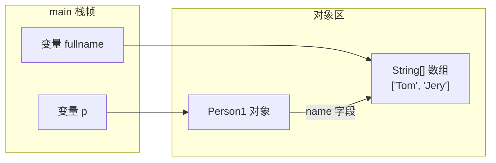
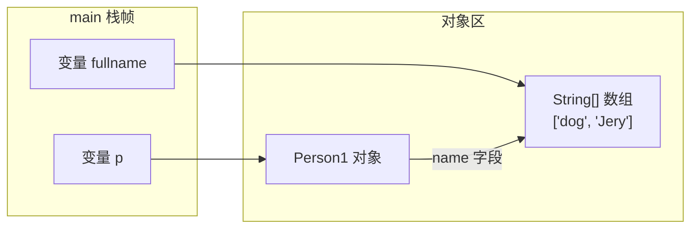
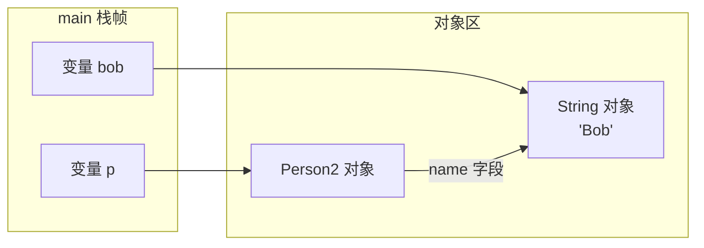
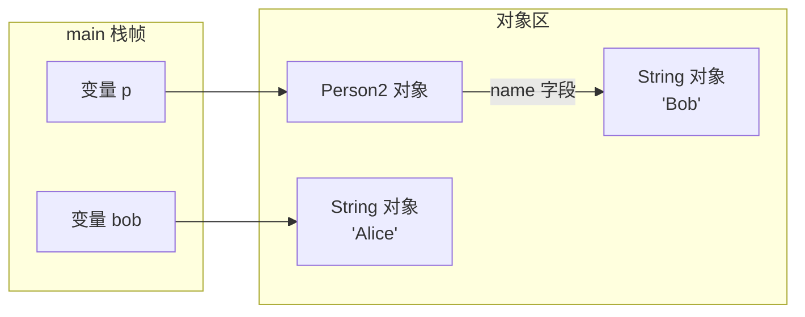

# playground-java-basics

## 模块目标
练 Java 基础语法、面向对象、集合、异常、泛型、反射、IO/NIO、Lambda 和 Stream。

## 学习范围
- `oop`
- `collection`
- `generic`
- `exception`
- `reflection`
- `io`
- `nio`
- `lambda`
- `stream`

## 包结构说明
- `oop`：面向对象练习包，放封装、继承、多态、接口和抽象类示例。
- `collection`：集合练习包，放 `List`、`Set`、`Map` 以及遍历、排序实验。
- `generic`：泛型练习包，放泛型类、泛型方法、通配符示例。
- `exception`：异常练习包，放异常分类、自定义异常和异常处理流程示例。
- `reflection`：反射练习包，放获取类信息、调用方法、操作字段等实验。
- `io`：传统 IO 练习包，放字节流、字符流、文件读写内容。
- `nio`：NIO 练习包，放 `Buffer`、`Channel`、`Path` 等实验。
- `lambda`：Lambda 表达式练习包，放函数式接口和简化写法示例。
- `stream`：Stream 流式处理练习包，放过滤、映射、聚合、分组操作。

## 学习资源
- [内部资源清单](../docs/resources/java-basics.md)
- [廖雪峰 Java 教程](https://liaoxuefeng.com/books/java/introduction/)
- [JavaGuide Java 学习路线](https://javaguide.cn/interview-preparation/java-roadmap.html)

## 练习任务
- [ ] 每个包写一个最小可运行示例
- [ ] 集合、反射、Stream 各补一份笔记
- [ ] 用测试或 `main` 方法复现实验结果

## 笔记区
### 第一章节、面向对象编程

#### 1.1 面向对象基础

##### 1.1.1 方法

- 方法可以让外部代码安全地访问实例字段；
- 方法是一组执行语句，并且可以执行任意逻辑；
- 方法内部遇到return时返回，void表示不返回任何值（注意和返回null不同）；
- 外部代码通过public方法操作实例，内部代码可以调用private方法；
- 方法的参数绑定理解：

参考canshubangding_02和canshubangding_03中的main方法输出的结果

**canshubangding_02**



这时 fullname 和 p.name 指向的是同一个数组对象。

执行 fullname[0] = "dog"; 后：



这里不是改“指向”，而是改“同一个数组对象内部的元素”，所以 p.getName() 也变了。

**canshubangding_03**
对应代码：canshubangding_03.java (line 7)

p.setName(bob); 执行后：



执行 bob = "Alice"; 后：



这里改的是 bob 这个变量的绑定方向，让它去指向新的 "Alice"；p.name 仍然指向原来的 "Bob"，所以输出没变。

**一句话记忆**
Java 的引用参数传递本质上仍然是“值传递”：

- 传过去的是“引用值的副本”
- 如果通过这个引用去改同一个对象，外面能看到
- 如果只是让某个变量重新指向别的对象，外面看不到


##### 1.1.2 构造方法

实例在创建时通过`new`操作符会调用其对应的构造方法，构造方法用于初始化实例；

没有定义构造方法时，编译器会自动创建一个默认的无参数构造方法；

可以定义多个构造方法，编译器根据参数自动判断；

可以在一个构造方法内部调用另一个构造方法，便于代码复用。主要通过this.()进行调用

```java
class Person {
    private String name;
    private int age;

    public Person(String name, int age) {
        this.name = name;
        this.age = age;
    }

    public Person(String name) {
        this(name, 18); // 调用另一个构造方法Person(String, int)
    }

    public Person() {
        this("Unnamed"); // 调用另一个构造方法Person(String)
    }
}

```


##### 1.1.3 重载方法

这种方法名相同，但各自的参数不同，称为方法重载（`Overload`）

方法重载的目的是，功能类似的方法使用同一名字，更容易记住，因此，调用起来更简单。(构造函数就似乎典型的例子)


##### 1.1.4 继承

继承是面向对象编程的一种强大的代码复用方式；

Java只允许单继承，所有类最终的根类是`Object`；

`protected`允许子类访问父类的字段和方法；

子类的构造方法可以通过`super()`调用父类的构造方法；

可以安全地向上转型为更抽象的类型；

可以强制向下转型，最好借助`instanceof`判断；

子类和父类的关系是is，has(组合)关系不能用继承。


##### 1.1.5 多态

子类可以覆写父类的方法（Override），覆写在子类中改变了父类方法的行为；

Java的方法调用总是作用于运行期对象的实际类型，这种行为称为多态；

`final`修饰符有多种作用：

- `final`修饰的方法可以阻止被覆写；
- `final`修饰的class可以阻止被继承；
- `final`修饰的field必须在创建对象时初始化，随后不可修改。


##### 1.1.6 抽象类

无法实例化的抽象类有什么用？

因为抽象类本身被设计成只能用于被继承，因此，抽象类可以强迫子类实现其定义的抽象方法，否则编译会报错。因此，抽象方法实际上相当于定义了**“规范”**。这就是面向抽象编程。

面向抽象编程的本质就是：

- 上层代码只定义规范（例如：`abstract class Person`）；
- 不需要子类就可以实现业务逻辑（正常编译）；
- 具体的业务逻辑由不同的子类实现，**调用者并不关心**。


##### 1.1.7 接口

Java的接口（interface）定义了纯抽象规范，一个类可以实现多个接口；

接口也是数据类型，适用于向上转型和向下转型；

接口的所有方法都是抽象方法，接口不能定义实例字段；

接口可以定义`default`方法（JDK>=1.8)


在抽象类中，抽象方法本质上是定义接口规范：即规定高层类的接口，从而保证所有子类都有相同的接口实现，这样，多态就能发挥出威力。

如果一个抽象类没有字段，所有方法全部都是抽象方法：就可以把该抽象类改写为接口：`interface`

所谓`interface`，就是比抽象类还要抽象的纯抽象接口，因为它连字段都不能有。因为接口定义的所有方法默认都是`public abstract`的。

实现类可以不必覆写`default`方法。`default`方法的目的是，当我们需要给接口新增一个方法时，会涉及到修改全部子类。如果新增的是`default`方法，那么子类就不必全部修改，只需要在需要覆写的地方去覆写新增方法。


##### 1.1.8 静态字段和静态方法

静态字段属于所有实例“共享”的字段，实际上是属于`class`的字段；

调用静态方法不需要实例，无法访问`this`，但可以访问静态字段和其他静态方法；

静态方法常用于工具类和辅助方法。

**接口的静态字段**

因为`interface`是一个纯抽象类，所以它不能定义实例字段。但是，`interface`是可以有静态字段的，并且静态字段必须为`final`类型：

```java
public interface Person {
    public static final int MALE = 1;
    public static final int FEMALE = 2;
}
```

实际上，因为`interface`的字段只能是`public static final`类型，所以我们可以把这些修饰符都去掉，上述代码可以简写为：

```java
public interface Person {
    // 编译器会自动加上public static final:
    int MALE = 1;
    int FEMALE = 2;
}
```


##### 1.1.9 包

Java内建的`package`机制是为了避免`class`命名冲突；

JDK的核心类使用`java.lang`包，编译器会自动导入；

JDK的其它常用类定义在`java.util.*`，`java.math.*`，`java.text.*`，……；

包名推荐使用倒置的域名，例如`org.apache`。


##### 1.1.10 作用域

Java内建的访问权限包括`public`、`protected`、`private`和`package`权限；

Java在方法内部定义的变量是局部变量，局部变量的作用域从变量声明开始，到一个块结束；

`final`修饰符不是访问权限，它可以修饰`class`、`field`和`method`；

一个`.java`文件只能包含一个`public`类，但可以包含多个非`public`类。


**最佳实践**

如果不确定是否需要`public`，就不声明为`public`，即尽可能少地暴露对外的字段和方法。

把方法定义为`package`权限有助于测试，因为测试类和被测试类只要位于同一个`package`，测试代码就可以访问被测试类的`package`权限方法。

一个`.java`文件只能包含一个`public`类，但可以包含多个非`public`类。如果有`public`类，文件名必须和`public`类的名字相同。

**final**

用`final`修饰`class`可以阻止被继承；

用`final`修饰`method`可以阻止被子类覆写；

用`final`修饰`field`可以阻止被重新赋值；


##### 1.1.11 内部类

还有一种类，它被定义在另一个类的内部，所以称为内部类（Nested Class）

示例代码：

```java
// inner class
public class Main {
    public static void main(String[] args) {
        Outer outer = new Outer("Nested"); // 实例化一个Outer
        Outer.Inner inner = outer.new Inner(); // 实例化一个Inner
        inner.hello();
    }
}

class Outer {
    private String name;

    Outer(String name) {
        this.name = name;
    }

    class Inner {
        void hello() {
            System.out.println("Hello, " + Outer.this.name);
        }
    }
}

```

还有一种定义Inner Class的方法，它不需要在Outer Class中明确地定义这个Class，而是在方法内部，通过**匿名类**（Anonymous Class）来定义。

```java
// Anonymous Class
public class Main {
    public static void main(String[] args) {
        Outer outer = new Outer("Nested");
        outer.asyncHello();
    }
}

class Outer {
    private String name;

    Outer(String name) {
        this.name = name;
    }

    void asyncHello() {
        Runnable r = new Runnable() {
            @Override
            public void run() {
                System.out.println("Hello, " + Outer.this.name);
            }
        };
        new Thread(r).start();
    }
}

```

观察`asyncHello()`方法，我们在方法内部实例化了一个`Runnable`。`Runnable`本身是接口，接口是不能实例化的，所以这里实际上是定义了一个实现了`Runnable`接口的匿名类，并且通过`new`实例化该匿名类，然后转型为`Runnable`。在定义匿名类的时候就必须实例化它，定义匿名类的写法如下：

```java
Runnable r = new Runnable() {
    // 实现必要的抽象方法...
};
```


##### 1.1.12 字符串和编码

Java字符串`String`是**不可变对象**；

字符串操作不改变原字符串内容，而是返回新字符串；

常用的字符串操作：提取子串、查找、替换、大小写转换等；

Java使用Unicode编码表示`String`和`char`；

转换编码就是将`String`和`byte[]`转换，需要指定编码；

转换为`byte[]`时，始终优先考虑`UTF-8`编码。


#### 2.1 java核心类

##### 2.1.1 StringBUilder

`StringBuilder`是可变对象，用来高效拼接字符串；

`StringBuilder`可以支持链式操作，实现链式操作的关键是返回实例本身；

`StringBuffer`是`StringBuilder`的线程安全版本，现在很少使用。


##### 2.1.2 包装类型

Java的数据类型分两种：

- 基本类型：`byte`，`short`，`int`，`long`，`boolean`，`float`，`double`，`char`；
- 引用类型：所有`class`和`interface`类型。

引用类型可以赋值为`null`，表示空，但基本类型不能赋值为`null`：


Java核心库提供的包装类型可以把基本类型包装为`class`；

自动装箱和自动拆箱都是在编译期完成的（JDK>=1.5）；

装箱和拆箱会影响执行效率，且拆箱时可能发生`NullPointerException`；

包装类型的比较必须使用`equals()`；

整数和浮点数的包装类型都继承自`Number`；

包装类型提供了大量实用方法；

所有的包装类型都是不变类。

**最佳实践**

因为`Integer.valueOf()`可能始终返回同一个`Integer`实例，因此，在我们自己创建`Integer`的时候，以下两种方法：

- 方法1：`Integer n = new Integer(100);`
- 方法2：`Integer n = Integer.valueOf(100);`

方法2更好，因为方法1总是创建新的`Integer`实例


##### 2.1.3 枚举

Java使用`enum`定义枚举类型，它被编译器编译为`final class Xxx extends Enum { … }`；

通过`name()`获取常量定义的字符串，注意不要使用`toString()`；

通过`ordinal()`返回常量定义的顺序（无实质意义）；

可以为`enum`编写构造方法、字段和方法

`enum`的构造方法要声明为`private`，字段强烈建议声明为`final`；

`enum`适合用在`switch`语句中。


```java
public class meiju_10 {
    public static void main(String[] args) {
        /*Weekday day = Weekday.SUN;
        if (day == Weekday.SAT || day == Weekday.SUN) {
            System.out.println("Work at home!");
        } else {
            System.out.println("Work at office!");
        }*/

        /*int day = 1;
        if (day == Weekday.SUN) { // Operator '==' cannot be applied to 'int', 'com.learning.basics.oop
        }*/

        /*Weekday x = Weekday.SUN; // ok!
        Weekday y = Color.RED; // Compile error: incompatible types*/

        /*
        使用enum定义的枚举类是一种引用类型。
        引用类型比较，要使用equals()方法，如果使用==比较，它比较的是两个引用类型的变量是否是同一个对象。
        但enum类型可以例外。
        这是因为enum类型的每个常量在JVM中只有一个唯一实例，所以可以直接用==比较。
         */
        /*Weekday day = Weekday.MON;
        if (day == Weekday.FRI) { // ok!
        }
        if (day.equals(Weekday.SUN)) { // ok, but more code!
        }*/

        System.out.println(Weekday.MON.name()); // MON
        System.out.println(Weekday.THU.ordinal()); // 4
    }
}

enum Weekday {
    SUN, MON, TUE, WED, THU, FRI, SAT;
}

enum Color {
    RED, GREEN, BLUE;
}
```


##### 2.1.4 BigInteger

`BigInteger`用于表示任意大小的整数；

`BigInteger`是不变类，并且继承自`Number`；

将`BigInteger`转换成基本类型时可使用`longValueExact()`等方法保证结果准确。

```java
public class biginteger_11 {
    public static void main(String[] args) {

        // 定义
        BigInteger bi = new BigInteger("12345567890");

        // 乘法
        System.out.println(bi.pow(5));

        // 加法
        System.out.println(bi.add(new BigInteger("12345678901234567890")));

        BigInteger i = new BigInteger("123456789000");
        System.out.println(i.longValue()); // 123456789000
        System.out.println(i.multiply(i).longValueExact()); // Exception in thread "main" java.lang.ArithmeticException: BigInteger out of long range
    }
}
```


##### 2.1.5 BigDecimal

`BigDecimal`用于表示精确的小数，常用于财务计算；

比较`BigDecimal`的值是否相等，必须使用`compareTo()`而不能使用`equals()`。

```java
public class bigdecimal_12 {

    public static void main(String[] args) {
        // BigDecimal用scale()表示小数位数
        BigDecimal d1 = new BigDecimal("123.45");
        BigDecimal d2 = new BigDecimal("123.4500");
        BigDecimal d3 = new BigDecimal("1234500");
        System.out.println(d1.scale()); // 2,两位小数
        System.out.println(d2.scale()); // 4
        System.out.println(d3.scale()); // 0
        System.out.println("==============================");

        // 通过BigDecimal的stripTrailingZeros()方法，可以将一个BigDecimal格式化为一个相等的，但去掉了末尾0的BigDecimal：
        BigDecimal d4 = new BigDecimal("123.4500");
        BigDecimal d5 = d4.stripTrailingZeros();
        System.out.println(d4.scale()); // 4
        System.out.println(d5.scale()); // 2,因为去掉了00

        BigDecimal d6 = new BigDecimal("1234500");
        BigDecimal d7 = d6.stripTrailingZeros();
        System.out.println(d6.scale()); // 0
        System.out.println(d7.scale()); // -2
        System.out.println("==============================");

        BigDecimal d8 = new BigDecimal("123.456789");
        BigDecimal d9 = d8.setScale(4, RoundingMode.HALF_UP); // 四舍五入，123.4568
        BigDecimal d10 = d8.setScale(4, RoundingMode.DOWN); // 直接截断，123.4567
        System.out.println(d9); // 123.4568
        System.out.println(d10); // 123.4567
        System.out.println("==============================");

        // 对BigDecimal做加、减、乘时，精度不会丢失，但是做除法时，存在无法除尽的情况，这时，就必须指定精度以及如何进行截断：
        BigDecimal d11 = new BigDecimal("123.456");
        BigDecimal d12 = new BigDecimal("23.456789");
        BigDecimal d13 = d11.divide(d12, 10, RoundingMode.HALF_UP); // 保留10位小数并四舍五入
        System.out.println(d13);
        BigDecimal d14 = d11.divide(d12); // 报错：ArithmeticException，因为除不尽

        // 在比较两个BigDecimal的值是否相等时，要特别注意，使用equals()方法不但要求两个BigDecimal的值相等，还要求它们的scale()相等：
        // 总是使用compareTo()比较两个BigDecimal的值，不要使用equals()！
    }
}

```


##### 2.1.6 常用工具类

- Math：数学计算
- HexFormat：格式化十六进制数
- Random：生成伪随机数
- SecureRandom：生成安全的随机数


### 第二章节、集合

#### 2.1 List

我们考察`List<E>`接口，可以看到几个主要的接口方法：

- 在末尾添加一个元素：`boolean add(E e)`
- 在指定索引添加一个元素：`boolean add(int index, E e)`
- 删除指定索引的元素：`E remove(int index)`
- 删除某个元素：`boolean remove(Object e)`
- 获取指定索引的元素：`E get(int index)`
- 获取链表大小（包含元素的个数）：`int size()`


实现`List`接口并非只能通过数组（即`ArrayList`的实现方式）来实现，另一种`LinkedList`通过“链表”也实现了List接口。在`LinkedList`中，它的内部每个元素都指向下一个元素：


我们来比较一下`ArrayList`和`LinkedList`：

|                     | ArrayList    | LinkedList           |
| ------------------- | ------------ | -------------------- |
| 获取指定元素        | 速度很快     | 需要从头开始查找元素 |
| 添加元素到末尾      | 速度很快     | 速度很快             |
| 在指定位置添加/删除 | 需要移动元素 | 不需要移动元素       |
| 内存占用            | 少           | 较大                 |

通常情况下，我们总是优先使用`ArrayList`。


```java
 public static void main(String[] args) {

        /*
        使用iterator进行遍历
         */
        List<String> list = List.of("1", "2", "3", "4", "5", "6", "7", "8", "9"); // 创建list可以使用List.of方法，但这种方法不接受null值
        Iterator<String> iterator = list.iterator();
        while (iterator.hasNext()) {
            System.out.println(iterator.next());
        }

        /*
        List和Array转换
         */
        List<Integer> list1 = List.of(12, 34, 56);
//        Object[] array = list1.toArray(); // 不推荐，此类转换会丢失类型信息
        Integer[] array = list1.toArray(new Integer[3]); // 推荐转换写法
    }
```


#### 2.2 Map

`Map`是一种映射表，可以通过`key`快速查找`value`；

可以通过`for each`遍历`keySet()`，也可以通过`for each`遍历`entrySet()`，直接获取`key-value`；

最常用的一种`Map`实现是`HashMap`


#### 2.3  equals和hashcode

equals正确覆写，使用Objects的静态方法

```java
    @Override
    public boolean equals(Object obj) {
        if(obj instanceof Person p) {
            return Objects.equals(this.firstName, p.firstName) && Objects.equals(this.lastName, p.lastName) && this.age == p.age;
        }
        return false;
    }
```


hashcode的覆写方式

```java
public class Person {
    String firstName;
    String lastName;
    int age;

    @Override
    int hashCode() {
        int h = 0;
        h = 31 * h + firstName.hashCode();
        h = 31 * h + lastName.hashCode();
        h = 31 * h + age;
        return h;
    }
}
```


要正确使用`HashMap`，作为`key`的类必须正确覆写`equals()`和`hashCode()`方法；

一个类如果覆写了`equals()`，就必须覆写`hashCode()`，并且覆写规则是：

- 如果`equals()`返回`true`，则`hashCode()`返回值必须相等；
- 如果`equals()`返回`false`，则`hashCode()`返回值尽量不要相等。

实现`hashCode()`方法可以通过`Objects.hashCode()`辅助方法实现。


#### 2.4 TreeMap

`SortedMap`在遍历时严格按照Key的顺序遍历，最常用的实现类是`TreeMap`；

作为`SortedMap`的Key必须实现`Comparable`接口，或者传入`Comparator`；

要严格按照`compare()`规范实现比较逻辑，否则，`TreeMap`将不能正常工作。


```java
public class a03_treemap {
    public static void main(String[] args) {
        Map<Person, Integer> map = new TreeMap<>(new Comparator<Person>() {
            @Override
            public int compare(Person o1, Person o2) {
                return o1.name.compareTo(o2.name);
            }
        });

        map.put(new Person("Tom"), 1);
        map.put(new Person("Jerry"), 2);
        map.put(new Person("Lily"), 3);
        for (Person key : map.keySet()) {
            System.out.println(key);
        }

        System.out.println(map.get(new Person("Lily")));
    }
}

class Person {
    public String name;

    public Person (String name) {
        this.name = name;
    }

    @Override
    public String toString() {
        return "{Person: " + name + "}";
    }
}
```

注意到`Comparator`接口要求实现一个比较方法，它负责比较传入的两个元素`a`和`b`，如果`a<b`，则返回负数，通常是`-1`，如果`a==b`，则返回`0`，如果`a>b`，则返回正数，通常是`1`。`TreeMap`内部根据比较结果对Key进行排序。

从上述代码执行结果可知，打印的Key确实是按照`Comparator`定义的顺序排序的。如果要根据Key查找Value，我们可以传入一个`new Person("Bob")`作为Key，它会返回对应的`Integer`值`2`。

另外，注意到`Person`类并未覆写`equals()`和`hashCode()`，因为`TreeMap`不使用`equals()`和`hashCode()`。


我们来看一个稍微复杂的例子：这次我们定义了`Student`类，并用分数`score`进行排序，高分在前：

```java
public class Main {
    public static void main(String[] args) {
        Map<Student1, Integer> map = new TreeMap<>(new Comparator<Student1>() {
            public int compare(Student1 p1, Student1 p2) {
                if (p1.score == p2.score) {
        			return 0;
    			}
                return p1.score > p2.score ? -1 : 1;
            }
        });
        map.put(new Student1("Tom", 77), 1);
        map.put(new Student1("Bob", 66), 2);
        map.put(new Student1("Lily", 99), 3);
        for (Student1 key : map.keySet()) {
            System.out.println(key);
        }
        System.out.println(map.get(new Student1("Bob", 66))); // null?
    }
}

class Student1 {
    public String name;
    public int score;
    Student1(String name, int score) {
        this.name = name;
        this.score = score;
    }
    public String toString() {
        return String.format("{%s: score=%d}", name, score);
    }
}
```

返回值有三种情况:0,正,负       

返回值为正: 前者(也就是o1)权重大,o1向后排      

 返回值为负: 后者(也就是o2)权重大,o2向后排       

返回值为0: 权重相等,不交换


#### 2.5 Set

`Set`用于存储不重复的元素集合，它主要提供以下几个方法：

- 将元素添加进`Set<E>`：`boolean add(E e)`
- 将元素从`Set<E>`删除：`boolean remove(Object e)`
- 判断是否包含元素：`boolean contains(Object e)`


```java
public class Main {
    public static void main(String[] args) {
        List<Message> received = List.of(
            new Message(1, "Hello!"),
            new Message(2, "发工资了吗？"),
            new Message(2, "发工资了吗？"),
            new Message(3, "去哪吃饭？"),
            new Message(3, "去哪吃饭？"),
            new Message(4, "Bye")
        );
        List<Message> displayMessages = process(received);
        for (Message message : displayMessages) {
            System.out.println(message.text);
        }
    }

    static List<Message> process(List<Message> received) {
        // TODO: 按sequence去除重复消息
        Set<Message> processed = new HashSet<>(received);
        List<Message> displayMessages = new ArrayList<>();
        for (Message message : processed) {
                displayMessages.add(message);
        }
        return displayMessages;
    }
}

class Message {
    public final int sequence;
    public final String text;
    public Message(int sequence, String text) {
        this.sequence = sequence;
        this.text = text;
    }

    @Override
    public int hashCode() {
        return this.sequence;
    }

    @Override
    public boolean equals(Object obj) {
        if (obj instanceof Message that) {
            return this.sequence == that.sequence;
        }
        return false;
    }
}
```


#### 2.6 Queue

队列`Queue`实现了一个先进先出（FIFO）的数据结构：

- 通过`add()`/`offer()`方法将元素添加到队尾；
- 通过`remove()`/`poll()`从队首获取元素并删除；
- 通过`element()`/`peek()`从队首获取元素但不删除。

要避免把`null`添加到队列。

```java
// 这是一个List:
List<String> list = new LinkedList<>();
// 这是一个Queue:
Queue<String> queue = new LinkedList<>();

```


#### 2.7 PriorityQueue

`PriorityQueue`实现了一个优先队列：从队首获取元素时，总是获取优先级最高的元素；

`PriorityQueue`默认按元素比较的顺序排序（必须实现`Comparable`接口），也可以通过`Comparator`自定义排序算法（元素就不必实现`Comparable`接口）

```java
public class Main {
    public static void main(String[] args) {
        Queue<User> q = new PriorityQueue<>(new UserComparator());
        // 添加3个元素到队列:
        q.offer(new User("Bob", "A1"));
        q.offer(new User("Alice", "A2"));
        q.offer(new User("Boss", "V1"));
        System.out.println(q.poll()); // Boss/V1
        System.out.println(q.poll()); // Bob/A1
        System.out.println(q.poll()); // Alice/A2
        System.out.println(q.poll()); // null,因为队列为空
    }
}

class UserComparator implements Comparator<User> {
    public int compare(User u1, User u2) {
        if (u1.number.charAt(0) == u2.number.charAt(0)) {
            // 如果两人的号都是A开头或者都是V开头,比较号的大小:
            return u1.number.compareTo(u2.number);
        }
        if (u1.number.charAt(0) == 'V') {
            // u1的号码是V开头,优先级高:
            return -1;
        } else {
            return 1;
        }
    }
}

class User {
    public final String name;
    public final String number;

    public User(String name, String number) {
        this.name = name;
        this.number = number;
    }

    public String toString() {
        return name + "/" + number;
    }
}
```


#### 2.8 Deque

`Deque`实现了一个双端队列（Double Ended Queue），它可以：

- 将元素添加到队尾或队首：`addLast()`/`offerLast()`/`addFirst()`/`offerFirst()`；
- 从队首／队尾获取元素并删除：`removeFirst()`/`pollFirst()`/`removeLast()`/`pollLast()`；
- 从队首／队尾获取元素但不删除：`getFirst()`/`peekFirst()`/`getLast()`/`peekLast()`；
- 总是调用`xxxFirst()`/`xxxLast()`以便与`Queue`的方法区分开；
- 避免把`null`添加到队列。

```java
// 不推荐的写法:
LinkedList<String> d1 = new LinkedList<>();
d1.offerLast("z");
// 推荐的写法：
Deque<String> d2 = new LinkedList<>();
d2.offerLast("z");
```


#### 2.9 Stack

栈（Stack）是一种后进先出（LIFO）的数据结构，操作栈的元素的方法有：

- 把元素压栈：`push(E)`；
- 把栈顶的元素“弹出”：`pop(E)`；
- 取栈顶元素但不弹出：`peek(E)`。

在Java中，我们用`Deque`可以实现`Stack`的功能，注意只调用`push()`/`pop()`/`peek()`方法，避免调用`Deque`的其他方法；

不要使用遗留类`Stack`。


#### 2.10 Iterator

Java的集合类都可以使用`for each`循环

```java
for (Iterator<String> it = list.iterator(); it.hasNext(); ) {
     String s = it.next();
     System.out.println(s);
}
```

while循环写法

```java
Iterator<String> it = list.iterator();
while(it.hasNext()){
    String s = it.next;
    System.out.println(s);
}
```


