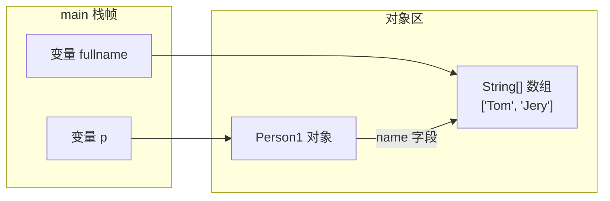
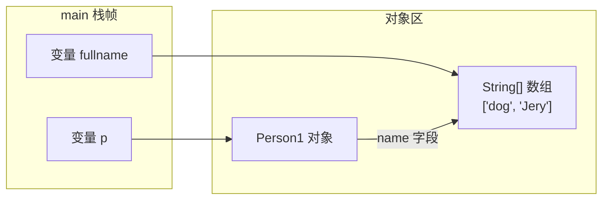
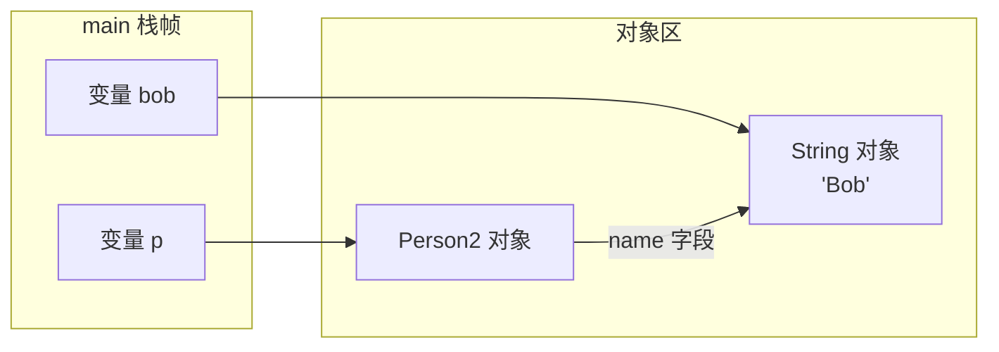
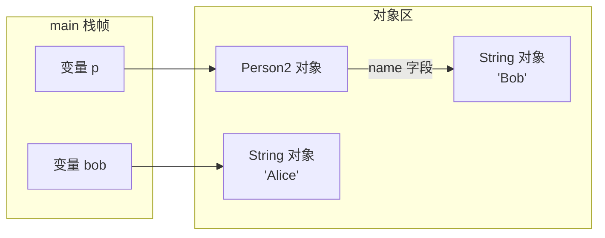

# playground-java-basics

## 模块目标
练 Java 基础语法、面向对象、集合、异常、泛型、反射、IO/NIO、Lambda 和 Stream。

## 学习范围
- `oop`
- `collection`
- `generic`
- `exception`
- `reflection`
- `io`
- `nio`
- `lambda`
- `stream`

## 包结构说明
- `oop`：面向对象练习包，放封装、继承、多态、接口和抽象类示例。
- `collection`：集合练习包，放 `List`、`Set`、`Map` 以及遍历、排序实验。
- `generic`：泛型练习包，放泛型类、泛型方法、通配符示例。
- `exception`：异常练习包，放异常分类、自定义异常和异常处理流程示例。
- `reflection`：反射练习包，放获取类信息、调用方法、操作字段等实验。
- `io`：传统 IO 练习包，放字节流、字符流、文件读写内容。
- `nio`：NIO 练习包，放 `Buffer`、`Channel`、`Path` 等实验。
- `lambda`：Lambda 表达式练习包，放函数式接口和简化写法示例。
- `stream`：Stream 流式处理练习包，放过滤、映射、聚合、分组操作。

## 学习资源
- [内部资源清单](../docs/resources/java-basics.md)
- [廖雪峰 Java 教程](https://liaoxuefeng.com/books/java/introduction/)
- [JavaGuide Java 学习路线](https://javaguide.cn/interview-preparation/java-roadmap.html)

## 练习任务
- [ ] 每个包写一个最小可运行示例
- [ ] 集合、反射、Stream 各补一份笔记
- [ ] 用测试或 `main` 方法复现实验结果

## 笔记区
### 第一章节、面向对象编程

#### 1.1 面向对象基础

##### 1.1.1 方法

- 方法可以让外部代码安全地访问实例字段；
- 方法是一组执行语句，并且可以执行任意逻辑；
- 方法内部遇到return时返回，void表示不返回任何值（注意和返回null不同）；
- 外部代码通过public方法操作实例，内部代码可以调用private方法；
- 方法的参数绑定理解：

参考canshubangding_02和canshubangding_03中的main方法输出的结果

**canshubangding_02**



这时 fullname 和 p.name 指向的是同一个数组对象。

执行 fullname[0] = "dog"; 后：



这里不是改“指向”，而是改“同一个数组对象内部的元素”，所以 p.getName() 也变了。

**canshubangding_03**
对应代码：canshubangding_03.java (line 7)

p.setName(bob); 执行后：



执行 bob = "Alice"; 后：



这里改的是 bob 这个变量的绑定方向，让它去指向新的 "Alice"；p.name 仍然指向原来的 "Bob"，所以输出没变。

**一句话记忆**
Java 的引用参数传递本质上仍然是“值传递”：

- 传过去的是“引用值的副本”
- 如果通过这个引用去改同一个对象，外面能看到
- 如果只是让某个变量重新指向别的对象，外面看不到


##### 1.1.2 构造方法

实例在创建时通过`new`操作符会调用其对应的构造方法，构造方法用于初始化实例；

没有定义构造方法时，编译器会自动创建一个默认的无参数构造方法；

可以定义多个构造方法，编译器根据参数自动判断；

可以在一个构造方法内部调用另一个构造方法，便于代码复用。主要通过this.()进行调用

```java
class Person {
    private String name;
    private int age;

    public Person(String name, int age) {
        this.name = name;
        this.age = age;
    }

    public Person(String name) {
        this(name, 18); // 调用另一个构造方法Person(String, int)
    }

    public Person() {
        this("Unnamed"); // 调用另一个构造方法Person(String)
    }
}

```


##### 1.1.3 重载方法

这种方法名相同，但各自的参数不同，称为方法重载（`Overload`）

方法重载的目的是，功能类似的方法使用同一名字，更容易记住，因此，调用起来更简单。(构造函数就似乎典型的例子)


##### 1.1.4 继承

继承是面向对象编程的一种强大的代码复用方式；

Java只允许单继承，所有类最终的根类是`Object`；

`protected`允许子类访问父类的字段和方法；

子类的构造方法可以通过`super()`调用父类的构造方法；

可以安全地向上转型为更抽象的类型；

可以强制向下转型，最好借助`instanceof`判断；

子类和父类的关系是is，has关系不能用继承。
